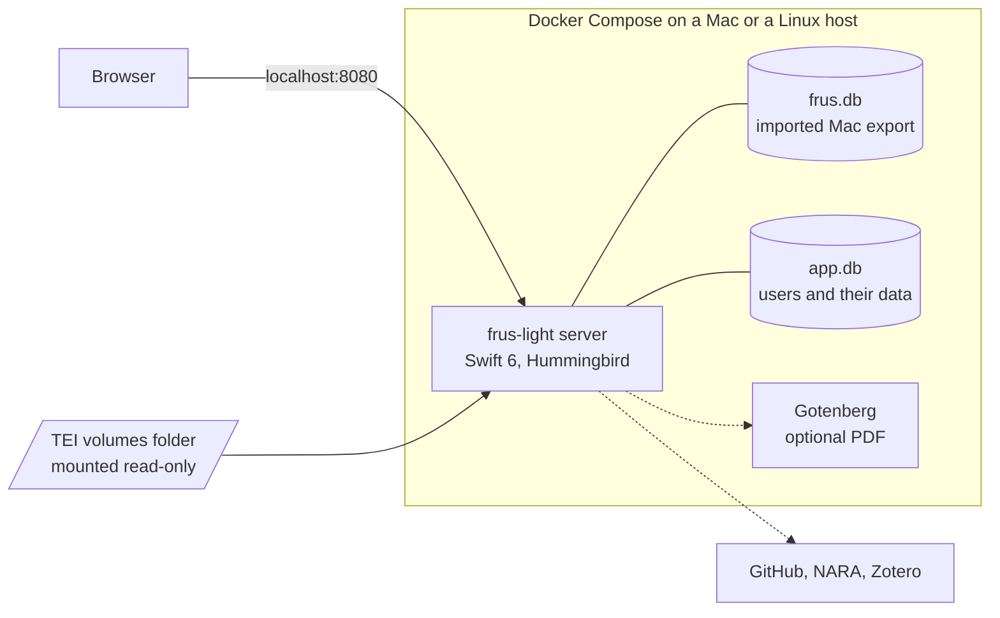

# FRUS Explorer Light

FRUS Explorer Light is a self-hosted web edition of [FRUS Explorer](https://github.com/joshbotts/FRUS-Explorer), the iOS, iPadOS and macOS app for researching the *Foreign Relations of the United States* series. One container serves the corpus, its full-text index, and each researcher's notes and highlights to any modern browser.

**Status:** early development. Session 0 built the scaffold: the pinned `FRUS-Explorer` submodule, the build scripts and CI. Session 2 added the server and Import mode, which checks a Mac export copied into `/data/import`, installs it and serves it read-only. Session 5 added the image and `compose.yaml`, with a Compose smoke test in CI. Session 7 publishes the image to GitHub Container Registry and adds the install guide, [`docs/INSTALL.md`](docs/INSTALL.md). Session 4 adds the parity harness, which compares the web edition's index, search and rendering with the Mac app's. Session 1 is done: with its Linux guards merged upstream, the six shared kits are built and tested on Linux in CI. Session 3 is done too: FRUSCoreKit, part 1, the app's TEI renderer and citation code, merged upstream, and CI renders the three fixture volumes with it on Linux, byte-identical to the Mac reader. So is session 6: FRUSCoreKit, part 2, the app's indexer, search and citation matcher, merged upstream, and CI indexes and searches the fixtures with it on Linux and compares the results with the Mac app's. Session 8 is done: the server searches and browses the imported index through the kit, opened read-only, and serves the reader's page, and CI runs the parity queries through its API. Session 9a adds the browser app at http://localhost:8080: it searches, opens a document in the reader and copies its citation, and CI runs that in Chromium against the image. See [`docs/PLAN.md`](docs/PLAN.md) and [`docs/DEVLOG.md`](docs/DEVLOG.md).

## Goals

- **Keep the research tools.** Browse, full-text search with the app's query language, the reader with highlights and notes, collections and their exports, citation tools, Source Explorer and analytics all stay. Search by meaning follows in a later phase.
- **Match the Mac app's results.** On the same inputs, the web edition must produce the same index rows, the same search results in the same order, and the same document HTML.
- **Serve a researcher or a small group.** One person on a laptop or a home server, or a class or team sharing one instance. It is not designed as a public, high-traffic site.
- **Deploy simply.** Docker Compose on a Mac or a Linux host first; a managed deployment on AWS follows in phase 6.

"Light" leaves out what depends on Apple-only frameworks: summary generation, iCloud sync, widgets and Live Activities, Spotlight, Handoff, TipKit tips, Audio Graphs and native multi-window scenes. Browser tabs replace windows, and data tables replace Audio Graphs. Summaries imported from the app are shown with their authorship labels, and people can write their own.

## Architecture

A Swift 6 server owns two SQLite files: `frus.db`, the corpus index, and `app.db`, the users and their data. The browser runs a TypeScript single-page app and shows document HTML that the server renders.

The diagram shows the Docker Compose install that ships first, with both databases in the `/data` volume. From phase 6, the same image also runs on AWS as one ECS task, with the index copied from S3.

| Part | Technology | Role |
| --- | --- | --- |
| Server | Swift 6 on Linux, Hummingbird 2 | REST API, sessions, jobs, and the single-page app's static files |
| Shared core | The Mac app's own Swift files, compiled from a pinned `FRUS-Explorer` submodule | Indexing, search and its query language, TEI parsing and HTML, citations, Source Explorer |
| Corpus index | SQLite FTS5 with the `porter unicode61` tokenizer | The Mac index's schema, at the pinned index version |
| User store | SQLite, with FTS5 over each user's notes and summaries | Notes, highlights, tags, collections, projects, users and sessions |
| Web client | TypeScript, React and Vite | Every screen. The reader reuses the app's own HTML, CSS and JavaScript in a sandboxed iframe |
| Optional services | `llama-server` running EmbeddingGemma; Gotenberg | Search by meaning; PDF export |

### Design decisions

| Decision | Reason |
| --- | --- |
| The index lives on the server, and the browser is a thin client | A container has real disk and CPU, so SQLite FTS5 runs natively, and one copy of user data needs no sync engine |
| The server compiles the Mac app's own Swift files | Query parsing, source-note parsing, citation matching and TEI rendering are large and heavily tested, and a second implementation would drift |
| The index comes from a Mac export, or the server builds it from TEI | The Mac's Export Research Database… file is version-stamped and verifiable, so serving it ships first; indexing on Linux follows |
| User data lives apart from the corpus index | The Mac index copies notes, summaries and tags into corpus rows, which a shared server cannot do |
| Summaries are shown and hand-written, never generated | Apple's on-device FoundationModels framework has no Linux equivalent |
| The reader reuses the app's rendering assets | Highlight offsets depend on that exact document structure |

## Deployment

- **Docker Compose, first:** one image and one Compose file on a Mac or a Linux host, listening on 127.0.0.1. Everything the server keeps lives in a named volume at `/data`, because SQLite's write-ahead log needs a local filesystem, and on a Mac a folder shared from macOS into Docker's virtual machine is not one. A folder of TEI volumes is mounted read-only, and a Mac export is imported with `docker compose cp`. CI publishes the image to GitHub Container Registry for amd64 and arm64.
- **AWS, in phase 6:** one ECS task on Fargate, in private subnets behind an Application Load Balancer that handles sign-in. At start the task copies a read-only snapshot of the index from S3 and opens it with SQLite's `immutable=1`. User data stays in SQLite, replicated to S3 by Litestream. A deploy stops the old task before starting the new one, trading a short outage for a single writer and no database service. The estimate is about $155–170 a month.

## Documents

- [`docs/INSTALL.md`](docs/INSTALL.md): installing the server with Docker Compose on a Mac or a Linux host, and importing a FRUS Explorer export.
- [`docs/PLAN.md`](docs/PLAN.md): the development plan. It covers the owner's setup, the rules every session follows, eleven sessions to phase 1 as a Compose install, the Compose install itself, the deferred AWS design, owner checkpoints and risks.
- [`docs/COORDINATION.md`](docs/COORDINATION.md): how the web edition and the Mac app's repository work together. App sessions follow four rules; web sessions carry the rest.
- [`docs/SPEC.md`](docs/SPEC.md): the specification. It covers what the web edition keeps, its architecture, data and operating modes, the HTTP API, deployment and runtime options, the managed-platform variant, verification and the delivery plan.
- [`docs/prep/`](docs/prep/README.md): readiness notes from a Linux dry run on 3 October, with the changes sessions 1–6 will need in the shared Swift files.
- Both files have living copies in shared documents, the [specification](https://claude.ai/code/artifact/b4714a33-dd0c-4205-a78f-6839a718afca) and the [plan](https://claude.ai/code/artifact/14a2723a-7662-496d-b7c4-1aa33678233e); ask the owner for access.
- The FRUS volumes come from the Office of the Historian's public [HistoryAtState/frus](https://github.com/HistoryAtState/frus) repository.

## License

Apache License 2.0; see [`LICENSE`](LICENSE). The FRUS text itself is in the public domain. EmbeddingGemma is never bundled with the image: an admin downloads it only after accepting the Gemma Terms of Use.
