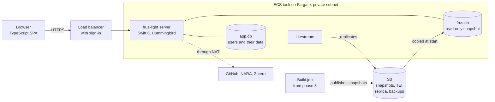

# FRUS Explorer Light

FRUS Explorer Light is a self-hosted web edition of [FRUS Explorer](https://github.com/joshbotts/FRUS-Explorer), the iOS, iPadOS and macOS app for researching the *Foreign Relations of the United States* series. One container serves the corpus, its full-text index, and each researcher's notes and highlights to any modern browser.

**Status:** planning. There is no code yet. Session 0, the repository scaffold, is next; see [`docs/PLAN.md`](docs/PLAN.md).

> FRUS Explorer Light is an independent project. It is not a product of the Office of the Historian or the U.S. Department of State. FRUS text is in the public domain.

## Goals

- **Keep the research tools.** Browse, full-text search with the app's query language, the reader with highlights and notes, collections and their exports, citation tools, Source Explorer and analytics all stay. Search by meaning follows in a later phase.
- **Match the Mac app's results.** On the same inputs, the web edition must produce the same index rows, the same search results in the same order, and the same document HTML.
- **Serve a researcher or a small group.** One person on a laptop or a home server, or a class or team sharing one instance. It is not designed as a public, high-traffic site.
- **Deploy simply.** Docker Compose on any Linux host, and a managed deployment on AWS as the first cloud target.

"Light" leaves out what depends on Apple-only frameworks: summary generation, iCloud sync, widgets and Live Activities, Spotlight, Handoff, TipKit tips, Audio Graphs and native multi-window scenes. Browser tabs replace windows, and data tables replace Audio Graphs. Summaries imported from the app are shown with their authorship labels, and people can write their own.

## Architecture

A Swift 6 server owns two SQLite files: `frus.db`, the corpus index, and `app.db`, the users and their data. The browser runs a TypeScript single-page app and shows document HTML that the server renders.

The diagram shows the AWS deployment. Self-hosted, the same image runs under Docker Compose, with both databases on a local disk.

| Part | Technology | Role |
| --- | --- | --- |
| Server | Swift 6 on Linux, Hummingbird 2 | REST API, sessions, jobs, and the single-page app's static files |
| Shared core | The Mac app's own Swift files, compiled from a pinned `FRUS-Explorer` submodule | Indexing, search and its query language, TEI parsing and HTML, citations, Source Explorer |
| Corpus index | SQLite FTS5 with the `porter unicode61` tokenizer | The Mac index's schema, at the pinned index version |
| User store | SQLite, with FTS5 over each user's notes and summaries | Notes, highlights, tags, collections, projects, users and sessions |
| Web client | TypeScript, React and Vite | Every screen. The reader reuses the app's own HTML, CSS and JavaScript in a sandboxed iframe |
| Optional services | `llama-server` running EmbeddingGemma; Gotenberg | Search by meaning; PDF export |

### Design decisions

| Decision | Reason |
| --- | --- |
| The index lives on the server, and the browser is a thin client | A container has real disk and CPU, so SQLite FTS5 runs natively, and one copy of user data needs no sync engine |
| The server compiles the Mac app's own Swift files | Query parsing, source-note parsing, citation matching and TEI rendering are large and heavily tested, and a second implementation would drift |
| The index comes from a Mac export, or the server builds it from TEI | The Mac's Export Research Database… file is version-stamped and verifiable, so serving it ships first; indexing on Linux follows |
| User data lives apart from the corpus index | The Mac index copies notes, summaries and tags into corpus rows, which a shared server cannot do |
| Summaries are shown and hand-written, never generated | Apple's on-device FoundationModels framework has no Linux equivalent |
| The reader reuses the app's rendering assets | Highlight offsets depend on that exact document structure |

## Deployment

- **Self-hosted:** one Docker image under Docker Compose on any Linux host, with `/data` on a local disk. SQLite's write-ahead log needs every process on one host, so `/data` never sits on object storage or a network share.
- **AWS, the first target:** one ECS task on Fargate, in private subnets behind an Application Load Balancer that handles sign-in. At start the task copies a read-only snapshot of the index from S3 and opens it with SQLite's `immutable=1`. User data stays in SQLite, replicated to S3 by Litestream. A deploy stops the old task before starting the new one, trading a short outage for a single writer and no database service. The estimate is about $155–170 a month.

## Documents

- [`docs/PLAN.md`](docs/PLAN.md): the development plan. It covers the owner's setup, the rules every session follows, thirteen sessions to phase 1 on AWS, the AWS resources, owner checkpoints and risks.
- The [specification](https://claude.ai/code/artifact/b4714a33-dd0c-4205-a78f-6839a718afca) and the living copy of the [plan](https://claude.ai/code/artifact/14a2723a-7662-496d-b7c4-1aa33678233e) are shared documents; ask the owner for access.
- The FRUS volumes come from the Office of the Historian's public [HistoryAtState/frus](https://github.com/HistoryAtState/frus) repository.

## License

Apache License 2.0; see [`LICENSE`](LICENSE). EmbeddingGemma is never bundled with the image: an admin downloads it only after accepting the Gemma Terms of Use.
