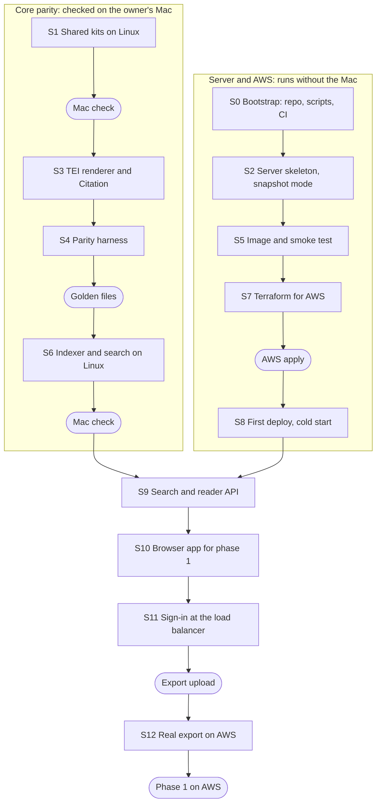

# FRUS Explorer Light — AWS Development Plan

28 September 2026 · Josh Botts

## Summary

Work starts in the existing private repository `joshbotts/FRUS-Explorer-Web-App`, and aims at one AWS deployment: a single ECS task on Fargate. The task serves the corpus index read-only from a snapshot in S3, and keeps user data in SQLite, replicated to S3 by Litestream. Each deploy stops the old task before starting the new one, so a short outage buys a single writer and no database service.

| Decision | Choice |
| --- | --- |
| Cloud | AWS first; Google Cloud and Azure are out of scope for now |
| Compute | ECS on Fargate, one task |
| User store | Option A from the spec: SQLite, replicated to S3 by Litestream |
| Deploys | Stop the old task, then start the new one; a short outage is accepted |

What this changes in the spec's delivery plan:

- **Phase 1 ships on Fargate.** Import mode already serves a read-only index, which is snapshot mode's serving path, so a Mac export is published to S3 and served from the task.
- **Litestream arrives in phase 2**, when user data first exists.
- **The build job arrives in phase 3.** Standalone indexing runs as a scheduled ECS task, not inside the server.
- **Option B, Cloud Run and Container Apps leave the plan.** The spec's five v1 choices stay, so they can return later.

The first deployable milestone is phase 1 on AWS: a real Mac export, searchable and readable at an HTTPS address, behind sign-in. Work proceeds in cloud sessions, each sized to one pull request with green CI, in two tracks: core parity, which needs the owner's Mac to verify, and server plus AWS, which does not.

## Before the first session

The owner makes these one-time settings before session 0. Only the AWS steps take more than a few minutes, and session 0 needs none of them.

**GitHub**

- [ ] Use `joshbotts/FRUS-Explorer-Web-App` for the web edition. On 28 September it held only a README and the Apache 2.0 licence.
- [ ] Select two repositories when starting each session: `FRUS-Explorer-Web-App`, where the work lands, and `FRUS-Explorer`, for the upstream pull requests phase 0 needs. A session's repositories are fixed when it starts.
- [ ] Confirm the Claude GitHub App is installed on both, from [claude.ai/connect-github](https://claude.ai/connect-github).
- [ ] Protect `main` on the web repository: changes arrive by pull request, and CI must pass. `FRUS-Explorer` is public, so CI can fetch it as a submodule without a token.

**Cloud environment** (the cloud environment menu in the session's title bar, then Edit)

- [ ] Network access: allow `registry.terraform.io`. It is blocked today, and `terraform init` fails without it. Allow `download.swift.org` only if you want Swift installed outside Docker; it is blocked too.
- [ ] Setup script: paste the script below. It starts Docker, pulls the Swift 6.4 image, and installs the SQLite headers and Terraform.
- [ ] Secrets: none. Sessions never hold AWS credentials; GitHub Actions deploys through OIDC.

```bash
#!/usr/bin/env bash
# Setup script for FRUS-Explorer-Web-App cloud sessions.
set -euo pipefail

# The image ships dockerd but does not start it.
if ! docker info >/dev/null 2>&1; then
  nohup dockerd >/var/log/dockerd.log 2>&1 &
  for _ in $(seq 1 30); do docker info >/dev/null 2>&1 && break; sleep 1; done
fi
docker pull -q swift:6.4-noble

# SQLite headers and CLI, for FTS5 work outside Docker.
apt-get update -qq
apt-get install -y -qq libsqlite3-dev sqlite3 unzip

# Terraform, for fmt, validate and plan. Needs registry.terraform.io allowed.
TF_VERSION=1.16.4
curl -fsSLo /tmp/terraform.zip \
  "https://releases.hashicorp.com/terraform/${TF_VERSION}/terraform_${TF_VERSION}_linux_amd64.zip"
unzip -o -q /tmp/terraform.zip -d /usr/local/bin
```

Each step was run in this session on 28 September. The session had 4 vCPUs, 15 GB of memory and about 30 GB of free disk. Docker 29.3.1 was installed but not running, Swift was absent, and Node 22.22.2 was present. Containers reach the network only with `--network host` and the session's proxy variables, which session 0 wraps in a script.

**AWS** (one-time)

- [ ] Choose the account and the region.
- [ ] Create a versioned S3 bucket for Terraform state. The S3 backend locks with `use_lockfile = true`, so no DynamoDB table is needed.
- [ ] Add GitHub's OIDC provider, `token.actions.githubusercontent.com`, and two IAM roles: a read-only role for `terraform plan` on pull requests, and a deploy role trusted only for a `production` environment on `main`.
- [ ] Register or delegate a domain in Route 53, for the load balancer's certificate and sign-in.
- [ ] Set a monthly budget alert.

**Mac** (needed by session 4, not before)

- [ ] Download three small fixture volumes in the Mac app: `frus1894Nicaragua` (1.27 MB), `frus1961-63v06` (1.65 MB) and `frus1969-76ve09p1` (1.89 MB). They span three eras and both print and electronic-only volumes.

## Repository layout and session rules

The web repository compiles the Mac app's shared Swift files straight from a pinned `FRUS-Explorer` submodule, so parity comes from the build rather than from copying. Both halves of that were tested here. A target whose path points into the nested checkout compiled SourceNoteKit and passed its 219 tests on Linux. A `CSQLite` system module linked SQLite 3.45.1 with FTS5.

```text
FRUS-Explorer-Web-App/
├── CLAUDE.md                  session rules, kept short
├── docs/PLAN.md               this plan and its checklist
├── docs/SPEC.md               the specification
├── docs/DEVLOG.md             one entry per session
├── Package.swift              the server, plus Linux builds of the shared kits
├── upstream/FRUS-Explorer/    git submodule, pinned to a merged commit
├── Sources/CSQLite/           system module for SQLite on Linux
├── Sources/FRUSLightCore/     web-only logic: snapshot loader, overlay, user store
├── Sources/FRUSLightServer/   Hummingbird 2 executable
├── Tests/                     unit tests and the parity harness
├── fixtures/tei/              the three fixture volumes, about 4.8 MB
├── fixtures/golden/           Mac-generated golden outputs, as JSON
├── web/                       the TypeScript SPA (React, Vite)
├── docker/Dockerfile          multi-stage image
├── infra/terraform/           AWS: network, ECR, ECS, ALB, S3, IAM
├── scripts/swift              runs swift in swift:6.4-noble with the session proxy
├── scripts/doctor             checks the session's prerequisites
└── .github/workflows/         ci, terraform, image and deploy
```

These rules go into `CLAUDE.md` in session 0:

1. Start with `scripts/doctor`. Build and test only through `scripts/swift` and `npm --prefix web`.
2. One session, one pull request, on the branch the session is given. Push before the session ends, and never push to `main`.
3. A session ends with CI green on its pull request, an entry in `docs/DEVLOG.md`, and its task ticked in `docs/PLAN.md`, with the next task named.
4. Shared behaviour is compiled from the submodule, never reimplemented. A fix to a shared file is a pull request on `FRUS-Explorer`, labelled for Mac verification; a session never merges it.
5. The submodule pin moves only to a merged `FRUS-Explorer` commit, in a pull request of its own.
6. Never commit Mac exports, TEI beyond `fixtures/`, EmbeddingGemma, credentials, `.build/` or `node_modules/`.
7. Sessions run `terraform fmt` and `validate` only. `plan` runs in CI under the read-only role, and `apply` runs from `main` after an approval.

| Workflow | Runs on | Does |
| --- | --- | --- |
| `ci.yml` | Every pull request | Swift build and test in `swift:6.4-noble`; SPA lint, test and build; `terraform fmt -check` and `validate` |
| `terraform.yml` | Pull requests that touch `infra/`, and `main` | `plan` under the read-only role; `apply` on `main` after approval in the `production` environment |
| `image.yml` | `main` | Builds the image, runs the container smoke test, and pushes to ECR tagged with the commit |
| `deploy.yml` | Manual, or after `image.yml` | Registers a task definition with the new image, updates the service, and waits for it to settle |

## Session plan

Thirteen sessions take the project to phase 1 on AWS. They alternate between two tracks, so work continues while the owner verifies on the Mac or applies on AWS.



S0 comes first, and the core track starts after it. The tracks join at session 9, whose search and reader endpoints need both the Linux indexer and the server. Each row below is one pull request; the larger ones, S6 and S10, may take two sessions.

| Session | Track | Delivers | Done when |
| --- | --- | --- | --- |
| S0 | Both | The scaffold: the submodule pinned to `FRUS-Explorer`'s current `main`, `Package.swift` with the Linux-ready kits and `CSQLite`, both scripts, `CLAUDE.md`, the log and `ci.yml` | CI runs SourceNoteKit's 219, CrossRefKit's 10 and GeneratorKit's 7 tests, plus an FTS5 check, and passes |
| S1 | Core | An upstream pull request with Linux guards: `FoundationXML` in TEIHeaderKit, swift-crypto in SemanticVectorsKit, and `CSQLite` plus a logging shim in FTS5Store | All six portable kits build on Linux and their tests pass: the spec's check 1 |
| S2 | Server | The Hummingbird 2 server: configuration, `/healthz`, `/readyz` and `/api/v1/status`; snapshot mode's loader, hash check, `immutable=1` open and overlay; the spec's five v1 interfaces | Tests start the server on a snapshot they build, and walk `/readyz` through every step |
| S3 | Core | `FRUSCoreKit`, part 1: the TEI parser, AST, render conversion, HTML serializer and Citation, compiled from the app's own files | The renderer turns the three fixture volumes into HTML on Linux, and the citation fixtures pass |
| S4 | Core | The parity harness: a script that summarizes any `frus.db` (row counts and a content hash per table, ordered by natural key), the query list, and the tests for checks 2–4 | The tests run against golden files as soon as the owner commits them |
| S5 | Server | `docker/Dockerfile`, a container smoke test, and `image.yml` | CI builds the image, starts it on a fixture snapshot, and gets 200 from `/readyz` |
| S6 | Core | `FRUSCoreKit`, part 2: `IndexingPipeline` and `SearchService` on Linux | Checks 2–4 pass on the three fixture volumes, with indexing speed and memory recorded: phase 0's exit |
| S7 | AWS | `infra/terraform` and `terraform.yml`: the network and its NAT gateway, S3, ECR, ECS, the load balancer, IAM and logs | `validate` passes in the session, and `plan` in CI |
| S8 | AWS | The first deploy of the skeleton, and a cold-start test with a 9.3 GB synthetic snapshot | The HTTPS address answers; time to ready is measured and the grace period is set from it |
| S9 | Both | Search, browse and document-render endpoints over the snapshot | Check 3 passes through the API |
| S10 | Both | The SPA for phase 1: Browse, Search, the reader and Cite | Playwright on Chromium searches, opens a document and copies a citation |
| S11 | AWS | Sign-in at the load balancer, with `FRUS_AUTH=header` verifying the load balancer's signed identity token | Unauthenticated requests are redirected, and a forged header is refused |
| S12 | AWS | `frus-light publish`, and the owner's real export published with it | Checks 3–5 pass on the real export served from AWS: phase 1's exit |

After phase 1, sessions follow the spec's phases 2–5 with two AWS additions: Litestream and the writer lease arrive with phase 2's user data, and the build job arrives with phase 3 as a scheduled ECS task.

## AWS track

One Terraform root, `infra/terraform`, creates the whole deployment in one account and region. ECS runs exactly one task, and a deploy stops it before starting the next, so there is never a second writer.

| Piece | Setting |
| --- | --- |
| Network | A VPC across two Availability Zones. The task runs in private subnets with no public IP, so only the load balancer is reachable from the internet, and the service passes Security Hub's ECS.2 check. Outbound traffic leaves through one NAT gateway with a fixed Elastic IP. An S3 gateway endpoint carries snapshot copies and image layers, so they skip the NAT gateway's per-gigabyte charge |
| S3 | One bucket with `snapshots/`, `tei/`, `litestream/` and `backups/`. Versioning on, public access blocked, SSE-S3 encryption, noncurrent versions expired after 30 days |
| ECR | One repository: immutable tags, scan on push, the last 20 images kept |
| Task definition | Fargate on Linux x86-64; 2 vCPU and 8 GB to start, since the spec's sizing is an estimate; 50 GiB of ephemeral storage; `stopTimeout` 120; logs to CloudWatch |
| Service | `desiredCount` 1, `minimumHealthyPercent` 0 and `maximumPercent` 100; the deployment circuit breaker with rollback; a health-check grace period set from session 8's measurement |
| Load balancer | HTTPS with an ACM certificate, HTTP redirected to HTTPS, health checks on `/readyz`, and sign-in from session 11 |
| DNS | A Route 53 alias record for the domain |
| IAM | Execution role: pull from ECR and write logs. Task role: read `snapshots/` and `tei/`, and from phase 2 read and write `litestream/` and `backups/`. GitHub roles: plan, read-only; deploy, which pushes images, updates the service and passes the two task roles |
| Alarms | Fewer than one running task, unhealthy targets, and a rising rate of 5xx responses |

A deploy runs in five steps:

1. A merge to `main` runs `image.yml`, which builds, smoke-tests and pushes `frus-light:<commit>`.
2. `deploy.yml` registers a task definition with that image and updates the service.
3. ECS sends the old task SIGTERM, allows it up to 120 seconds, then starts the new one.
4. The new task copies the snapshot, restores `app.db` from phase 2 on, and passes `/readyz`.
5. The workflow waits for the service to settle and checks that `/api/v1/status` reports the new build. If the new task never becomes healthy, the circuit breaker rolls back.

The outage is the stop plus one cold start: about one to three minutes by the spec's estimate, until session 8 measures it.

**Publishing a snapshot.** In phase 1 the owner runs `frus-light publish` on the Mac, with their own AWS credentials, against a Mac export. It runs the Import checks, checkpoints the copy and switches it to rollback journal mode, and hashes every file. It then uploads to a new `snapshots/<id>/` prefix and replaces `current.json` with a conditional write. A forced new deployment picks the snapshot up; switching without a restart arrives with the build job in phase 3.

**Sign-in.** The load balancer authenticates users, either through an Amazon Cognito user pool whose users only the admin creates, or through the owner's organisation's OIDC provider. The server runs with `FRUS_AUTH=header`. It trusts `x-amzn-oidc-identity` only after verifying the ES256 signature on `x-amzn-oidc-data` against the load balancer's regional public-key endpoint, and it checks that the token's signer is this load balancer.

**Litestream.** From phase 2, Litestream 0.5.17 ships in the image. The server runs it under its writer lease, replicating to `litestream/`, and the nightly SQLite backup goes to `backups/`.

| Item | Approximate monthly cost |
| --- | --- |
| Fargate task, 2 vCPU and 8 GB, always on | $85 |
| Ephemeral storage beyond the free 20 GiB | $3 |
| NAT gateway, one, with the traffic it carries | $33–36 |
| Application Load Balancer | $20–25 |
| Public IPv4 addresses: two for the load balancer, one for the NAT gateway | $11 |
| S3, about 15 GB including old versions | Under $1 |
| Route 53 zone and queries | About $1 |
| CloudWatch logs and alarms | $2–5 |
| **Total** | **About $155–170** |

These are us-east-1 list prices from memory; AWS pricing pages were unreachable from this session, so check them in the AWS Pricing Calculator. The NAT gateway is the price of private subnets, and a second one, for resilience across zones, would add about $33. Fargate on Graviton costs about a fifth less, and the image targets both architectures, so the task can move once CI builds arm64.

## Owner checkpoints

Nine steps need the owner, because a cloud session has no Mac, no Xcode and no AWS credentials. Sessions keep working on the other track while each one waits.

| Checkpoint | When | What the owner does | Status |
| --- | --- | --- | --- |
| Settings | Before S0 | The GitHub, environment and AWS items under Before the first session | To do |
| Mac check 1 | After S1 | Check out the upstream pull request in `FRUS-Explorer`, build both schemes in Xcode, run the unit tests, and merge if they pass | To do |
| Mac check 2 | After S3 | The same for the TEI and Citation guards | To do |
| Golden files | After S4 | Download the three fixture volumes in the Mac app, export the research database, run the harness's summary script on the export and its render and query tool on the Mac, and commit `fixtures/golden/` | To do |
| Mac check 3 | After S6 | The same as Mac check 1, for the indexer and search guards | To do |
| AWS bootstrap | Before S7's first plan | The state bucket, the OIDC provider and both roles, and the domain | To do |
| AWS apply | After S7 | Approve the `production` run of `terraform.yml` | To do |
| Export upload | Before S12 | Export the full research database on the Mac, about 9 GB, and run `frus-light publish` | To do |
| Phase 1 sign-off | After S12 | Use the site, and confirm checks 3–5 on the real export | To do |

The Mac checks are cheap on purpose. Every Linux change to a shared file is a `#if canImport` guard, so the Apple build should compile exactly what it compiled before; the check proves it.

## Risks and open questions

The largest risk is session 6. The indexer is one 11,568-line file inside the app target, and it imports UIKit, CoreSpotlight, SwiftData, OSLog, SQLite3 and CryptoKit.

| Risk | Why it matters | Mitigation |
| --- | --- | --- |
| The indexer is tied to the app | `IndexingPipeline.swift` uses six Apple modules, with 35 logging lines alone. The TEI directory adds WebKit, SwiftUI and UIKit, though only in its view files | Compile the app's files by name from the submodule; guard each Apple-only use upstream; budget S6 as two sessions |
| Mac checks are the bottleneck | Three upstream pull requests wait on the owner's Xcode run | Alternate the tracks, and keep each upstream change to guards only |
| Foundation differs on Linux | XML parsing, regular expressions, dates and Unicode can differ without an error | Golden files from the same code on macOS, and checks 2–4 before feature work |
| Session disk | About 30 GB was free here, shared by the Swift image, build caches and fixtures; a 9 GB export does not fit comfortably | Fixtures only in sessions; the full corpus runs on AWS, in S8 and S12 |
| Upstream churn | `FRUS-Explorer`'s index version went from 49 to 54 in 19 days | Move the pin in its own pull request; `publish` refuses a snapshot whose index version the server does not support |
| Account constraints | A government account may restrict regions or Cognito | Confirm the account type and region before S7 |
| Litestream's new format | Version 0.5 changed the replica format, and a replica is only as good as its last restore | Pin 0.5.17, and restore the replica in CI and in phase 5's drill |
| One NAT gateway | It sits in one Availability Zone. If that zone fails, a replacement task cannot pull its image, and calls to GitHub, NARA and Zotero stop | Accept it for one task that already takes deploy outages; add a second NAT gateway, about $33 a month, if uptime starts to matter |

Open questions for the owner:

- Which AWS account and region, and is it a commercial or a GovCloud account?
- Which domain should the site use?
- Should sign-in use Cognito or your organisation's identity provider?
- May sessions open pull requests on `FRUS-Explorer` for you to verify and merge? The spec work left that repository untouched.

## Session 0 kickoff prompt

Start a cloud session with both repositories selected, and paste this as its first message.

```text
This is session 0 of FRUS Explorer Light, the self-hosted web edition of FRUS Explorer.
Repositories: joshbotts/FRUS-Explorer-Web-App, where you work, and joshbotts/FRUS-Explorer, read-only this session.

Read first: docs/PLAN.md, the development plan, and docs/SPEC.md, the specification. Their living copies are shared documents:
- Plan: https://claude.ai/code/artifact/14a2723a-7662-496d-b7c4-1aa33678233e
- Specification: https://claude.ai/code/artifact/b4714a33-dd0c-4205-a78f-6839a718afca
If a shared document and its file disagree, tell me before you act on either.

Goal: the scaffold, with CI green. Do not change FRUS-Explorer in this session.

1. Check prerequisites: Docker running, the swift:6.4-noble image present, and registry.terraform.io reachable. If the environment's setup script did not run, run its steps yourself and tell me which failed.
2. Add FRUS-Explorer as a git submodule at upstream/FRUS-Explorer, pinned to its current main.
3. Write scripts/swift, which runs swift inside swift:6.4-noble with the repository mounted, --network host, and the session's proxy variables and CA bundle. Write scripts/doctor, which checks everything in step 1.
4. Write Package.swift (swift-tools-version 6.0): a CSQLite system library target; SourceNoteKit, CrossRefKit and GeneratorKit and their test targets, compiled from the submodule's own directories; and an FRUSLightServer executable that prints its version.
5. Add an FTS5 test that creates frus_documents with the DDL that FTS5Store/FTS5Types.swift builds (porter unicode61), inserts two rows, and matches a stemmed prefix inside a NEAR group.
6. Add .github/workflows/ci.yml: check out with submodules, then run swift build and swift test in a swift:6.4-noble container with libsqlite3-dev installed.
7. Write CLAUDE.md with the seven session rules from docs/PLAN.md, and docs/DEVLOG.md with this session's entry.
8. Add the three fixture volumes to fixtures/tei/ from HistoryAtState/frus (branch master, volumes/<id>.xml): frus1894Nicaragua, frus1961-63v06 and frus1969-76ve09p1.

Done when CI passes on your pull request, running SourceNoteKit's 219, CrossRefKit's 10 and GeneratorKit's 7 tests plus the FTS5 test. End by naming S1 as the next session in docs/DEVLOG.md.
```
