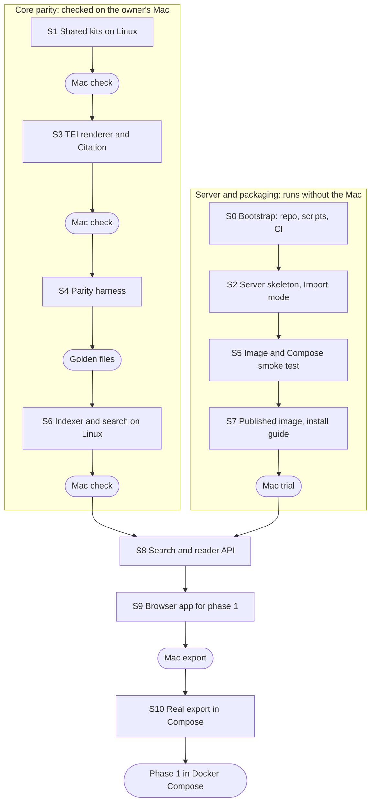

# FRUS Explorer Light — Development Plan

28 September 2026 · Josh Botts

## Summary

Work starts in `joshbotts/FRUS-Explorer-Web-App` and ships a Docker Compose install first: one image that runs on a Mac or a Linux host with `docker compose up`. The AWS deployment moves to phase 6, as the spec first planned, and its design stays recorded below, so that phase can start without re-deciding it.

| Decision | Choice |
| --- | --- |
| First offering | Docker Compose on a Mac or a Linux host, one user on localhost |
| Image | Built in CI and published to GitHub Container Registry, for amd64 and arm64 |
| User store | SQLite in the `/data` volume, backed up nightly from phase 2 |
| AWS | Deferred to phase 6: one ECS task on Fargate in private subnets, with snapshot mode and Litestream |

What this changes from the previous plan:

- **Phase 1 ships as a Compose install.** Import mode serves a Mac export from the `/data` volume, and the reader uses TEI files mounted read-only.
- **Sign-in waits for phase 3.** Phase 1 listens on 127.0.0.1 with no accounts, as the spec's phase 1 does. Local accounts arrive with multi-user support.
- **No cloud account is needed before phase 6.** CI publishes the image with the repository's own token, so there is no AWS setup, Terraform or NAT gateway until then.

The first deployable milestone is phase 1 in Compose: a real Mac export, searchable and readable at `http://localhost:8080` after `docker compose up`. Work proceeds in cloud sessions, each sized to one pull request with green CI, in two tracks: core parity, which needs the owner's Mac to verify, and server plus packaging, which does not.

## Before the first session

The owner makes these one-time settings before session 0. None takes more than a few minutes.

**GitHub**

- [x] Use `joshbotts/FRUS-Explorer-Web-App` for the web edition. It holds the README, this plan and the specification.
- [x] Make the web repository public. On GitHub Free, branch protection and native arm64 runners are offered only for public repositories, and their Actions minutes are free.
- [ ] Select two repositories when starting each session: `FRUS-Explorer-Web-App`, where the work lands, and `FRUS-Explorer`, for the upstream pull requests phase 0 needs. A session's repositories are fixed when it starts.
- [ ] Confirm the Claude GitHub App is installed on both, from [claude.ai/connect-github](https://claude.ai/connect-github).
- [x] After S0's first CI run, protect `main` on the web repository: changes arrive by pull request, with no required approvals, since you merge your own, and CI's `swift` job is a required check. After S5, `compose` is required too. GitHub offers a check only after it has run once. `FRUS-Explorer` is public, so CI can fetch it as a submodule without a token.
- [x] Before S7, let GitHub Actions publish packages. `image.yml` asks for `packages: write`; if your account restricts workflow permissions, allow it.

**Cloud environment** (the cloud environment menu in the session's title bar, then Edit)

- [ ] Setup script: paste the script below. It starts Docker, pulls the Swift 6.4 image, and installs the SQLite headers.
- [ ] Network access: nothing to add. The AWS phase will need `registry.terraform.io`.
- [ ] Secrets: none. CI publishes the image with the repository's own token.

```bash
#!/usr/bin/env bash
# Setup script for FRUS-Explorer-Web-App cloud sessions.
set -euo pipefail

# The image ships dockerd but does not start it.
if ! docker info >/dev/null 2>&1; then
  nohup dockerd >/var/log/dockerd.log 2>&1 &
  for _ in $(seq 1 30); do docker info >/dev/null 2>&1 && break; sleep 1; done
fi
docker pull -q swift:6.4-noble

# SQLite headers and CLI, for FTS5 work outside Docker.
apt-get update -qq
apt-get install -y -qq libsqlite3-dev sqlite3
```

Each step was run in this session on 28 September. The session had 4 vCPUs, 15 GB of memory and about 30 GB of free disk. Docker 29.3.1, with Compose 5.1.1 and Buildx 0.31.1, was installed but not running; Swift was absent, and Node 22.22.2 was present. Containers reach the network only with `--network host` and the session's proxy variables, which session 0 wraps in a script.

**Mac** (the owner's machine)

- [x] Install a container runtime that runs Compose files: Docker Desktop, Podman Desktop or Colima. Docker Desktop needs a paid subscription in larger organisations, so check what yours allows.
- [ ] After session 0 pins the submodule, build FRUS Explorer in Xcode 27 from the pinned commit, which `git submodule status` names. Make the golden files after S4 and the export before S10 with this build. Golden files from other code test the wrong thing, and the server rejects an export from another index version. When the pin moves, rebuild, make a new three-volume export with that build as the top of `scripts/make-golden` describes, and refresh the golden files with `scripts/make-golden --export <file>` in the pull request that moves the pin: its `swift` check fails on golden files made from other app sources or resources.
- [x] Download three small fixture volumes in the Mac app, before session 4: `frus1894Nicaragua` (1.27 MB), `frus1961-63v06` (1.65 MB) and `frus1969-76ve09p1` (1.89 MB). They span three eras and both print and electronic-only volumes. The Mac's copies are byte-identical to HistoryAtState/frus commit `8e5da08`.

`scripts/mac-check` checks these items, plus macOS 26 or later and Xcode 27, and marks anything due later. It changes nothing. If macOS asks, let Terminal access data from other apps.

## Repository layout and session rules

The web repository compiles the Mac app's shared Swift files straight from a pinned `FRUS-Explorer` submodule, so parity comes from the build rather than from copying. Both halves of that were tested here. A target whose path points into the nested checkout compiled SourceNoteKit and passed its tests on Linux. A `CSQLite` system module linked SQLite 3.45.1 with FTS5. On 3 October, at `34a5120`, a dry run of the whole S0 package passed SourceNoteKit's 292 tests, CrossRefKit's 10 and GeneratorKit's 7, and the FTS5 check, in `swift:6.4-noble` with no warnings. `docs/prep/` records what that run found for later sessions.

```text
FRUS-Explorer-Web-App/
├── CLAUDE.md                  session rules, kept short
├── compose.yaml               the Docker Compose install
├── docs/PLAN.md               this plan and its checklist
├── docs/SPEC.md               the specification
├── docs/INSTALL.md            install, import, upgrade and backup, from session 7
├── docs/DEVLOG.md             one entry per session
├── docs/prep/                 readiness notes and Linux change lists for S1–S6
├── Package.swift              the server, plus Linux builds of the shared kits
├── upstream/FRUS-Explorer/    git submodule, pinned to a merged commit
├── Sources/CSQLite/           system module for SQLite on Linux
├── Sources/FRUSLightCore/     web-only logic: import, overlay, user store
├── Sources/FRUSLightServer/   Hummingbird 2 executable
├── Tests/                     unit tests and the parity harness
├── fixtures/tei/              the three fixture volumes, about 4.8 MB
├── fixtures/parity/           the check-3 query list and its rules
├── fixtures/golden/           Mac-generated golden outputs, as JSON and HTML
├── web/                       the TypeScript SPA (React, Vite)
├── docker/Dockerfile          multi-stage image
├── scripts/swift              runs swift in swift:6.4-noble with the session proxy
├── scripts/doctor             checks the session's prerequisites
├── scripts/mac-check          checks the owner's Mac against this plan
├── scripts/make-golden        writes the golden files on the owner's Mac
├── tools/mac-golden/          Mac-only: runs the app's own code for the golden files
└── .github/workflows/         ci and image; terraform and deploy arrive in phase 6
```

These rules go into `CLAUDE.md` in session 0:

1. Start with `scripts/doctor`. Build and test only through `scripts/swift`, `npm --prefix web` and `docker compose`.
2. One session, one pull request, on the branch the session is given. Push before the session ends, and never push to `main`.
3. A session ends with CI green on its pull request and an entry in `docs/DEVLOG.md` that records what it delivered and names the next task.
4. Shared behaviour is compiled from the submodule, never reimplemented. A fix to a shared file is a pull request on `FRUS-Explorer`, labelled for Mac verification; a session never merges it.
5. The submodule pin moves only to a merged `FRUS-Explorer` commit, in a pull request of its own.
6. Never commit Mac exports, TEI beyond `fixtures/`, EmbeddingGemma, credentials, `.build/` or `node_modules/`.
7. Sessions never publish images. CI publishes from `main`.

| Workflow | Runs on | Does |
| --- | --- | --- |
| `ci.yml` | Every pull request | Swift build and test in `swift:6.4-noble`; SPA lint, test and build; the image build and a Compose smoke test |
| `image.yml` | `main` | Builds amd64 and arm64 images natively and pushes them to GitHub Container Registry under the commit's tag; after a Compose smoke test on both, moves `edge` to that build |

## Session plan

Eleven sessions take the project to phase 1 as a Compose install. They alternate between two tracks, so work continues while the owner verifies on the Mac.



S0 comes first, and the core track starts after it. The tracks join at session 8, whose search and reader endpoints need both the Linux indexer and the server. Each row below is one pull request; the larger ones, S6 and S9, may take two sessions.

| Session | Track | Delivers | Done when |
| --- | --- | --- | --- |
| S0 | Both | The scaffold: the submodule pinned to `34a5120` on `FRUS-Explorer`'s `v2` branch, which matches the owner's Mac build and export (index version 65); `Package.swift` with the Linux-ready kits and `CSQLite`; both scripts, `CLAUDE.md`, the log and `ci.yml`; the fixtures, with their SHA-256 sums | CI runs every test in SourceNoteKit, CrossRefKit and GeneratorKit at the pin, none skipped (292, 10 and 7 at `34a5120`), plus an FTS5 check, and passes |
| S1 | Core | An upstream pull request with Linux guards: `FoundationXML` in TEIHeaderKit, swift-crypto in SemanticVectorsKit, and `CSQLite` plus a logging shim in FTS5Store | All six portable kits build on Linux and their tests pass: the spec's check 1 |
| S2 | Server | The Hummingbird 2 server: configuration, `/healthz`, `/readyz` and `/api/v1/status`; Import mode, which validates a Mac export and opens it with `immutable=1`; the spec's five v1 interfaces | Tests import a synthetic export they build, and walk `/readyz` through every step |
| S3 | Core | `FRUSCoreKit`, part 1, an upstream pull request: the TEI parser, AST, render conversion and HTML serializer, the citation formatter, parser and models, and `PageSpanResolver`, compiled from the app's own files. The reader's path is the kit's public API (`ReaderLookups`, the converter's `init(readerOf:lookups:brokenRefs:)` and the serializer's `reader`), and the app's reader calls it too. The kit's suites run in Xcode and under `swift test`. After the merge, the pin-move pull request adds the kit to CI | The renderer turns the three fixture volumes into HTML on Linux through the kit's public API, byte-identical to the golden files, and check 7's formatter and parser half passes |
| S4 | Core | The parity harness: `frus-parity`, which summarizes any `frus.db` (row counts and a content hash per table, ordered by natural key); the query list; `tools/mac-golden`, which runs the app's own code on the Mac to write the golden files; and the tests for checks 2–4 | The tests run against golden files as soon as the owner commits them |
| S5 | Server | `docker/Dockerfile`, `compose.yaml` with the optional Gotenberg service, and a Compose smoke test in `ci.yml` | CI runs `docker compose up` on a synthetic export and gets 200 from `/readyz` |
| S6 | Core | `FRUSCoreKit`, part 2: `IndexingPipeline` and `SearchService` on Linux, and the citation matcher, block splitter and `PageRangeStore`, which need them | Checks 2–4 pass on the three fixture volumes, with indexing speed and memory recorded: phase 0's exit. Check 7's matcher and splitter half passes: CitationMatchingEngineTests (74), CitationBlockSplitterTests (18) and the ManifestStore formatter test |
| S7 | Server | `image.yml`, publishing amd64 and arm64 images, and `docs/INSTALL.md` for a Mac and a Linux host | The owner installs from the published image by following the guide |
| S8 | Both | Search, browse and document-render endpoints over the imported index | Check 3 passes through the API |
| S9 | Both | The SPA for phase 1: Browse, Search, the reader and Cite | Playwright on Chromium searches, opens a document and copies a citation |
| S10 | Both | The owner's real export imported into Compose, with a TEI folder mounted read-only, as chosen before S7 | Checks 3–5 pass on the real export: phase 1's exit |

Before writing the S1, S2, S3 and S4 prompts, read `docs/prep/README.md`. A dry run on 3 October found what each of those sessions needs beyond this table, and recorded the Linux changes for S1, S3 and S6.

After phase 1, sessions follow the spec's phases 2–5. Phase 2 adds user data and its nightly backup. Phase 3 adds Standalone indexing, local accounts and a reverse-proxy recipe for sharing beyond localhost. AWS returns as phase 6.

## Docker Compose install

Phase 1 ships as one image and one Compose file. Everything the server keeps lives in a named volume at `/data`, and a folder of TEI volumes is mounted read-only. Session 5 built both; the repository's `compose.yaml` is the working version of the sketch below. It adds hardening and settings, and puts Gotenberg behind a `pdf` profile, off by default.

```yaml
services:
  frus:
    image: ghcr.io/joshbotts/frus-explorer-light:edge
    ports:
      - "127.0.0.1:8080:8080"
    volumes:
      - frus-data:/data
      # TEI volumes, read-only: ./tei by default, or FRUS_TEI_DIR
      - "${FRUS_TEI_DIR:-./tei}:/data/volumes:ro"
    environment:
      FRUS_MODE: import
      FRUS_AUTH: none
      FRUS_PUBLIC_URL: http://localhost:8080
      FRUS_PDF_URL: http://pdf:3000
    restart: unless-stopped

  pdf:                             # optional; remove it to hide PDF export
    image: gotenberg/gotenberg:8
    restart: unless-stopped

volumes:
  frus-data: {}
```

Importing a Mac export takes three steps:

1. On the Mac, use Settings ▸ Data & Recovery ▸ Export Research Database…. The full corpus is about 2.8 GB, measured on 3 October.
2. Copy the file into the volume with `docker compose cp <export file> frus:/data/import/`.
3. The server runs the Import checks, moves the file into place and opens it read-only. `/readyz` reports each step.

- **`/data` stays a named volume.** On a Mac, Docker runs Linux in a virtual machine, and a folder shared from macOS is not a local filesystem to it, while SQLite's WAL needs one. Only the TEI folder is a bind mount, and it is read-only.
- **FRUS Explorer's TEI folder needs Docker Desktop's permission.** Session 5 found that Docker Desktop is refused the app's folder under `~/Library/Containers`, because macOS keeps other apps out of an app's container. A clone of HistoryAtState/frus works: its `volumes/` folder holds the same TEI XML the app downloads, though not the figure images the app fetches from static.history.state.gov. Allowing Docker Desktop to read FRUS Explorer's data in System Settings fixes this, and gives the figure images too; `docs/INSTALL.md` uses that on a Mac and the clone on Linux.
- **The port listens on 127.0.0.1**, so nothing else on the network can reach it. Sharing beyond localhost waits for phase 3's local accounts, behind a TLS reverse proxy such as Caddy.
- **Upgrades** are `docker compose pull` and then `docker compose up -d`. The index already sits in the volume, so a restart copies nothing. The server refuses an index whose version it does not support; export again from the Mac. `edge` tracks `main`; from the first release, tags follow the app build, such as `:48`.
- **Backups** start in phase 2, when user data exists: a nightly SQLite backup of `app.db` to `/data/backups`.
- **Disk:** a full export is about 2.8 GB. A re-import holds the export, its checked copy, the live index and the previous one, so allow about 15 GB free.
- **Memory:** importing and serving the full corpus used about 130 MB in session 7's rehearsal, well under the spec's 4 GB estimate. Search, from session 8, will need more.
- **Apple silicon:** the published image includes arm64, so it runs natively.

There is no hosting cost; the install runs on hardware the owner already has.

## Deferred: AWS deployment (phase 6)

AWS moves to phase 6, after hardening, as the spec first planned. The decisions below stand, so the phase can start without re-deciding them: one ECS task on Fargate, stop-before-start deploys, private subnets with one NAT gateway, snapshot mode and Litestream.

| Piece | Setting |
| --- | --- |
| Network | A VPC across two Availability Zones. The task runs in private subnets with no public IP, so only the load balancer is reachable from the internet, and the service passes Security Hub's ECS.2 check. Outbound traffic leaves through one NAT gateway with a fixed Elastic IP. An S3 gateway endpoint carries snapshot copies and image layers, so they skip the NAT gateway's per-gigabyte charge |
| S3 | One bucket with `snapshots/`, `tei/`, `litestream/` and `backups/`. Versioning on, public access blocked, SSE-S3 encryption, noncurrent versions expired after 30 days |
| ECR | One repository: immutable tags, scan on push, the last 20 images kept |
| Task definition | Fargate on Linux x86-64; 2 vCPU and 8 GB to start, since the spec's sizing is an estimate; 50 GiB of ephemeral storage; `stopTimeout` 120; logs to CloudWatch |
| Service | `desiredCount` 1, `minimumHealthyPercent` 0 and `maximumPercent` 100; the deployment circuit breaker with rollback; a health-check grace period set from a measured cold start |
| Load balancer | HTTPS with an ACM certificate, HTTP redirected to HTTPS, health checks on `/readyz`, and sign-in |
| DNS | A Route 53 alias record for the domain |
| IAM | Execution role: pull from ECR and write logs. Task role: read `snapshots/` and `tei/`, and read and write `litestream/` and `backups/`. GitHub roles: plan, read-only; deploy, which pushes images, updates the service and passes the two task roles |
| Alarms | Fewer than one running task, unhealthy targets, and a rising rate of 5xx responses |

The phase takes five sessions, and the owner acts between them:

1. **A1, Terraform:** `infra/terraform` and `terraform.yml` for the pieces above; `validate` in the session and `plan` in CI.
2. **A2, first deploy:** the published image on Fargate, and a cold-start test with a 9.3 GB synthetic snapshot that sets the grace period.
3. **A3, snapshot mode:** the server copies a snapshot from S3 at start, and `frus-light publish` checks a Mac export, checkpoints it, switches it to rollback journal mode, hashes it, uploads it under a new `snapshots/<id>/` prefix and replaces `current.json` with a conditional write.
4. **A4, sign-in:** the load balancer authenticates through Amazon Cognito or the owner's organisation's OIDC provider. The server runs with `FRUS_AUTH=header` and trusts `x-amzn-oidc-identity` only after verifying the ES256 signature on `x-amzn-oidc-data` and that the load balancer signed it.
5. **A5, Litestream:** Litestream 0.5.17 in the image, run by the server under its writer lease, replicating `app.db` to `litestream/`.

Before A1 the owner chooses the account and region; creates a versioned Terraform state bucket, which locks with `use_lockfile = true`; adds GitHub's OIDC provider with a read-only plan role and a deploy role trusted only for a `production` environment on `main`; registers a domain in Route 53; and sets a budget alert. The environment then needs `registry.terraform.io` allowed and Terraform added to the setup script.

A deploy stops the old task, allowing it up to 120 seconds, starts the new one, copies the snapshot and restores `app.db`, so the outage is one cold start: about one to three minutes by the spec's estimate.

| Item | Approximate monthly cost |
| --- | --- |
| Fargate task, 2 vCPU and 8 GB, always on | $85 |
| Ephemeral storage beyond the free 20 GiB | $3 |
| NAT gateway, one, with the traffic it carries | $33–36 |
| Application Load Balancer | $20–25 |
| Public IPv4 addresses: two for the load balancer, one for the NAT gateway | $11 |
| S3, about 15 GB including old versions | Under $1 |
| Route 53 zone and queries | About $1 |
| CloudWatch logs and alarms | $2–5 |
| **Total** | **About $155–170** |

These are us-east-1 list prices from memory; AWS pricing pages were unreachable from this session, so check them in the AWS Pricing Calculator. Three risks carry into the phase: a government account may restrict regions or Cognito; Litestream 0.5 changed its replica format, so a replica is only as good as its last restore; and one NAT gateway depends on one Availability Zone, which a second gateway at about $33 a month removes.

## Owner checkpoints

Eight steps need the owner, because a cloud session has no Mac and no Xcode. Sessions keep working on the other track while each one waits.

| Checkpoint | When | What the owner does | Status |
| --- | --- | --- | --- |
| Settings | Before S0 | The GitHub and environment items under Before the first session, and a container runtime on the Mac | To do |
| Mac check 1 | After S1 | Check out the upstream pull request in `FRUS-Explorer`, in a clone at a real path (not `/tmp`). Build both schemes in Xcode, run the unit tests and `swift test`, which alone runs the kits' own suites, and merge if they pass. The pull request lists the commands | Done |
| Mac check 2 | After S3 | Check out the upstream pull request in a clone at a real path. Clean builds of both schemes; the full iOS unit run, signed, with the same skips as on `v2`; `swift test`, with the `FRUSCoreKitTests` count the pull request states; and a normalized symbol diff of the two Mac debug libraries that shows only the names the pull request expects. Merge if they pass. The pull request lists the commands and the expected results | Done |
| Golden files | After S4, and after S3's pin move | In the pinned build of the Mac app, make a library holding exactly the three fixture volumes, for example under a second macOS user. Export its research database, run `scripts/make-golden --export` on the export, and commit `fixtures/golden/`. S4 made the golden files that need only the app's source. Done on 4 October from a build of `af8bedab`; each later pin move needs a new export | Done |
| Mac check 3 | After S6 | The same as Mac check 1, for the indexer and search guards | To do |
| Mac trial | After S7 | Install from the published image by following `docs/INSTALL.md`, and report anything the guide gets wrong | Done |
| Mac export | Before S10 | Export the full research database from the pinned build, about 2.8 GB, for the Compose install to import | To do |
| Phase 1 sign-off | After S10 | Use the site, and confirm checks 3–5 on the real export | To do |

The Mac checks are cheap on purpose: an upstream pull request for this project changes nothing on Apple platforms, and the check proves it. S1's changes were all `#if canImport` guards, so the Apple build compiled exactly what it compiled before. S3's also moves files into `FRUSCoreKit/` and declarations out of Apple-only files, keeping every old name, so Mac check 2 adds a symbol diff, which must show only the names the pull request expects. S6's will need moves too, as `docs/prep/README.md` records.

## Risks and open questions

The largest risk is session 6. The indexer is one 12,724-line file inside the app target, at `34a5120`. It imports CryptoKit, OSLog, SQLite3, CoreSpotlight and, on iOS, UIKit, and SwiftData reaches it through one parameter.

| Risk | Why it matters | Mitigation |
| --- | --- | --- |
| The indexer is tied to the app | `IndexingPipeline.swift` uses five Apple modules and SwiftData, with 35 logging lines alone. The TEI directory adds WebKit, SwiftUI and UIKit in its view files, and its model files need declarations that live in those view files. A dry run compiled the indexer and search on Linux with 48 app files | Compile the app's files by name from the submodule; move declarations out of Apple-only files and guard each Apple-only use upstream, as listed in `docs/prep/`; budget S6 as two sessions |
| Mac checks are the bottleneck | Three upstream pull requests wait on the owner's Xcode run | Alternate the tracks, and keep each upstream change to guards and moves that change nothing on Apple platforms |
| Foundation differs on Linux | XML parsing, regular expressions, dates and Unicode can differ without an error | Golden files from the same code on macOS, and checks 2–4 before feature work |
| Session disk | About 30 GB was free here, shared by the Swift image, build caches and fixtures; the full export is 2.8 GB | Fixtures only in sessions; the full corpus runs on the owner's Mac, in S10 |
| Upstream churn | `FRUS-Explorer`'s index version went from 47 to 65 in the 30 days to 2 October, with about eight pull requests merged a day until its public release | Hold the pin until the release where possible, and move it in its own pull request; the server refuses an export whose index version it does not support |
| arm64 builds | Most Macs run Apple silicon, and building Swift for arm64 under emulation in CI is slow | Use GitHub's native arm64 runner, free for public repositories; otherwise build arm64 only on `main`, or locally on the Mac |
| SQLite on a Mac | Docker on macOS runs Linux in a virtual machine, and a folder shared from macOS is not a local filesystem to SQLite | Keep `/data` in a named volume, and bind-mount only the read-only TEI folder |
| Container runtime licence | Docker Desktop needs a paid subscription in larger organisations | Podman Desktop and Colima run the same Compose file |

Open questions for the owner:

- Which container runtime does your organisation allow on Macs?

Answered on 3 October:

- The web repository goes public, which brings branch protection and native arm64 runners on GitHub Free.
- The published image is public too, so it pulls without signing in.
- TEI volumes: on a Mac, FRUS Explorer's own folder, once Docker Desktop is allowed to read it; on Linux, a shallow clone of HistoryAtState/frus. `docs/INSTALL.md` gives both.
- Sessions did not open pull requests on `FRUS-Explorer` while its public release was being prepared, so the core track (S1, S3, S6) waited and the server track (S2, S4, S5, S7) went ahead. The owner lifted that hold on 4 October. When S1 runs, it builds and tests the six kits against its upstream pull request's head in the session and records the result in `docs/DEVLOG.md`; after the owner's Mac check and merge, a separate pull request moves the pin and adds the kits to CI. That pull request also carries the golden files, made again at the new pin on the owner's Mac by `scripts/make-golden`.
- A session's `docs/DEVLOG.md` entry is the record that it is done (rule 3).
- S4 copies no upstream code, so renderer parity on Linux waits for S3.
- Check 3 passes when results differ only in the order of documents whose Mac scores are exactly equal. Each such group is reported.
- The golden files that depend only on the app's source are made in a session on the owner's Mac. The owner makes the two that need an export.

Answered on 4 October, for S3:

- S3's upstream pull request lands now, while `v2` is quiet, rather than after the public release.
- It is all of part 1: the TEI pipeline, the citation formatter, parser and models, `PageSpanResolver`, and the reader's path as public API, which `DocumentViewModel.load` and `HTMLTemplate.build` call. What S8 and S9 call is public too: `CrossRefDestination` and `FRUSURLScheme.resolveCrossRefTarget`, `CitationPlainText`, `CitationPunctuation`, `FRUSCanonicalURL` and `CitableDocumentNumber`. The citation matcher, the block splitter and `PageRangeStore` wait for S6, which brings SearchService and ManifestStore.
- The kit's suites are compiled twice, by Xcode and by `swift test`, with whatever needs the app inside `#if !SWIFT_PACKAGE`. They include three more parser suites, a source audit keeps the kit free of the app's names, and the source scans read `FRUSCoreKit/` wherever their rules apply.
- Mac check 2 is the one in the owner checkpoints above.
- The owner's three-volume export, for the Golden files checkpoint, waits until after S3's pin move. That move changes the source digest, so golden files made from an earlier export would go stale with it.

## Session 0 kickoff prompt

Start a cloud session with both repositories selected, and paste this as its first message.

```text
This is session 0 of FRUS Explorer Light, the self-hosted web edition of FRUS Explorer.
Repositories: joshbotts/FRUS-Explorer-Web-App, where you work, and joshbotts/FRUS-Explorer, read-only this session.

Read first: docs/PLAN.md, the development plan, and docs/SPEC.md, the specification. Their living copies are shared documents:
- Plan: https://claude.ai/code/artifact/14a2723a-7662-496d-b7c4-1aa33678233e
- Specification: https://claude.ai/code/artifact/b4714a33-dd0c-4205-a78f-6839a718afca
If a shared document and its file disagree, tell me before you act on either. If you cannot open the shared documents, work from the files and say so in docs/DEVLOG.md.

Goal: the scaffold, with CI green. Do not change FRUS-Explorer in this session.

1. Check prerequisites: Docker running with the Compose plugin, and the swift:6.4-noble image present. If the environment's setup script did not run, run its steps yourself and tell me which failed.
2. Add FRUS-Explorer as a git submodule at upstream/FRUS-Explorer, with the URL https://github.com/joshbotts/FRUS-Explorer.git, pinned to commit 34a5120507a4d7d2095217e29200229f0cda5c6a on its v2 branch. That commit matches the owner's Mac build and research export (index version 65). Check out the whole submodule: a SourceNoteKit test reads a file from FRUSExplorer/Resources.
3. Write scripts/swift, which runs swift inside swift:6.4-noble with the repository mounted, --network host, and the session's proxy variables and CA bundle when they are set. The image has no SQLite headers, so scripts/swift must provide libsqlite3-dev inside the container, through a small derived image or an apt step. Keep its build output apart from a Mac's own, for example with --scratch-path .build/linux. Write scripts/doctor, which checks everything in step 1, initialises the submodule if it is empty, and confirms it sits at the pin.
4. Write Package.swift (swift-tools-version 6.0): a CSQLite system library target; SourceNoteKit, CrossRefKit and GeneratorKit and their test targets, compiled from the submodule's own directories with the settings upstream's Package.swift gives them (Swift 6 language mode; SourceNoteKit excludes eval-baseline.txt and eval-report.txt); and an FRUSLightServer executable that prints its version. Add a .gitignore for .build/.
5. Add an FTS5 test. Compile FTS5Store/FTS5Types.swift from the submodule as a target of its own, excluding the directory's other files, and create frus_documents with FTS5Schema.frusDocuments.createTableSQL. It is an external-content table, so also create its content table, document_cache, and insert two rows into both. Assert that a stemmed prefix inside a NEAR group matches. FTS5's porter tokenizer stems a prefix term as if it were a whole word, so NEAR(negoti* treaty, 2) must match "negotiating treaties", and NEAR(negotiat* treaty, 2) must not: "negotiat" stays as it is, and no stored term begins with it.
6. Add .github/workflows/ci.yml: check out with submodules, then run swift build and swift test in a swift:6.4-noble container with libsqlite3-dev installed, the same way scripts/swift does. Print the test count per target, for example with swift test list | cut -d. -f1 | sort | uniq -c.
7. Write CLAUDE.md with the seven session rules from docs/PLAN.md, plus one line: upstream/FRUS-Explorer/CLAUDE.md is the Mac app's guide, and it governs only pull requests on that repository. Write docs/DEVLOG.md with this session's entry.
8. Add the three fixture volumes to fixtures/tei/ from HistoryAtState/frus at commit 8e5da08c1d99bbcdf69c34cef8c15dff91f95cf9 (volumes/<id>.xml): frus1894Nicaragua, frus1961-63v06 and frus1969-76ve09p1. They are the same bytes the owner's Mac app downloaded. Record the commit in fixtures/tei/SOURCE and the SHA-256 sums in fixtures/tei/SHA256SUMS, and check them against:
   c36aa079477928672a8f9cb98b37757a428452824ce15500db62e0636dd2c4cc  frus1894Nicaragua.xml
   48d571c05cad26e51d645c7a5fe7d5ea8b1d42e3f9a2c78ae97bf59a0e5c6f3f  frus1961-63v06.xml
   6f88c7c3078d374797db1cbf2ec2999e92c489170d4ce5df0cdcc5c22a612df8  frus1969-76ve09p1.xml

Done when CI passes on your pull request, running every test in SourceNoteKitTests, CrossRefKitTests and GeneratorKitTests at the pin, none skipped (292, 10 and 7 at 34a5120), plus the FTS5 test, with the count per target in its log. End by naming S1 as the next session in docs/DEVLOG.md.
```
