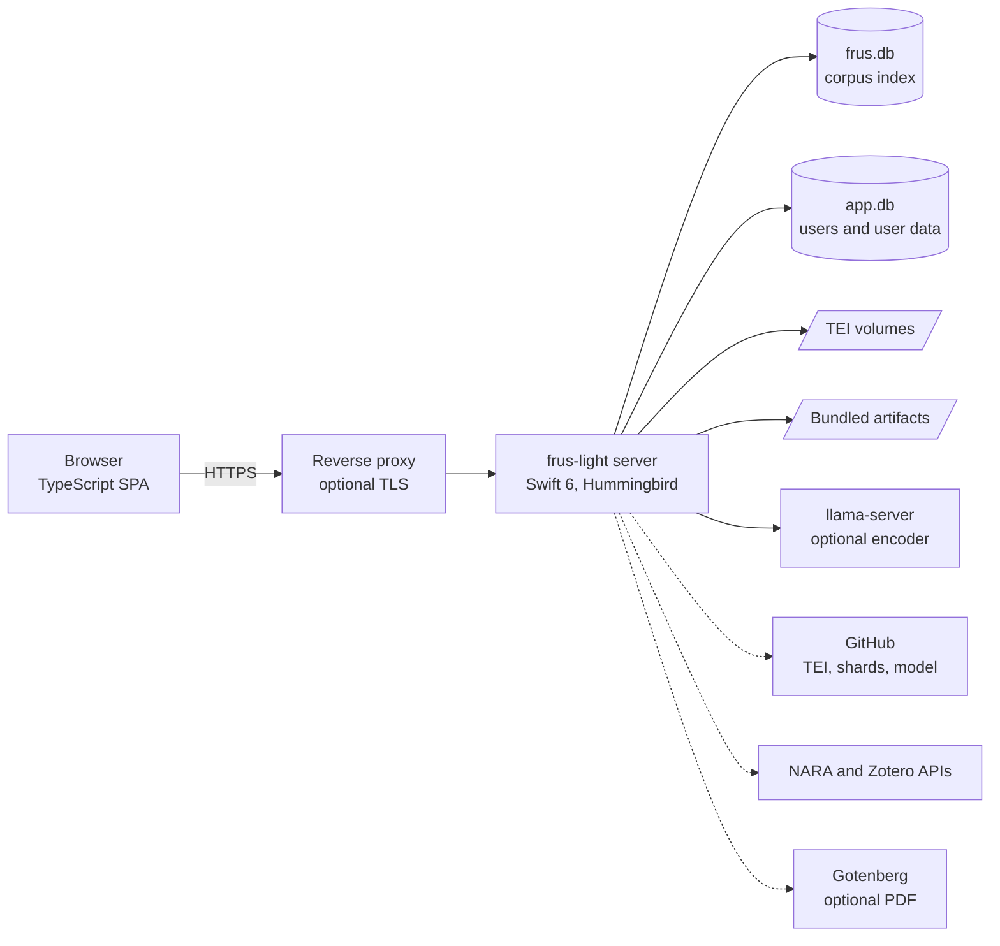
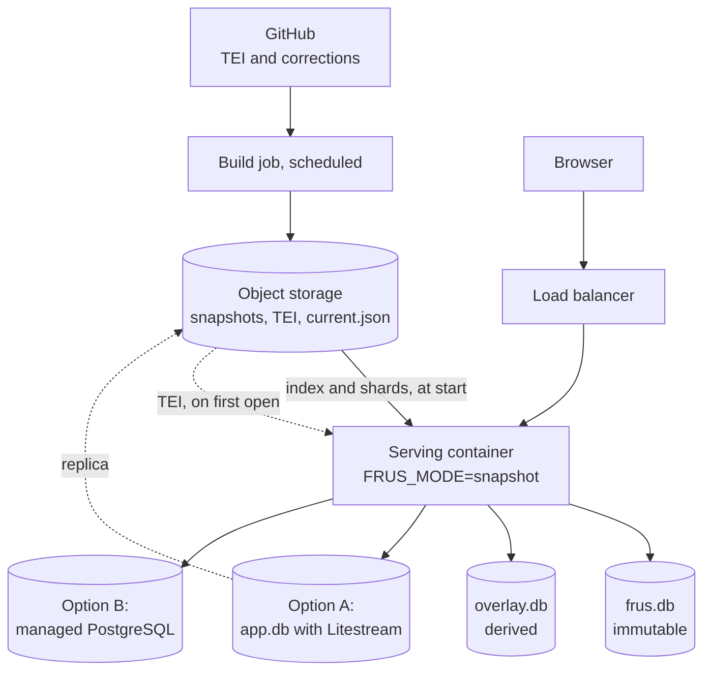

# FRUS Explorer Light — Web Edition Specification

2026-09-23 · Josh Botts

## Summary

FRUS Explorer Light is a self-hosted web edition of FRUS Explorer, shipped as one Docker image. It serves the FRUS corpus, its full-text index and each researcher's annotations to any modern browser. It keeps every feature that does not need on-device summarization, iCloud, or another Apple-only framework.

This specification was written against commit `c076203` (build 48, index format version 54). Six decisions shape it:

| # | Decision | Reason |
| --- | --- | --- |
| D1 | The index lives on the server; the browser is a thin client. | A container has real disk and CPU, so SQLite FTS5 runs natively. The server holds the one copy of user data, so no sync engine is needed. |
| D2 | The server is Swift 6 on Linux and compiles the same source files as the Mac app. | Query parsing, source-note parsing, citation matching and TEI rendering are large, subtle and heavily tested. A second implementation would drift. |
| D3 | Two data modes: **Import** serves a Mac "Export Research Database…" file; **Standalone** downloads and indexes TEI itself. | The Mac export already exists, is WAL-safe, version-stamped and verifiable. Import mode needs no Linux indexer, so it ships first. |
| D4 | User data lives in its own SQLite file, never in the corpus index. | The Mac index mirrors notes, summaries and tag ids into corpus rows. A shared server cannot. |
| D5 | Summaries are displayed and hand-written, never generated. | `FoundationModels` has no Linux equivalent, and generation is out of scope. Imported summaries keep their authorship labels. |
| D6 | The UI is a TypeScript single-page app; the reader reuses the app's own HTML, CSS and JavaScript. | The Mac reader already renders TEI to HTML in a web view, and highlight offsets depend on that exact DOM. |

**What "Light" removes:** summary generation, iCloud sync, widgets and Live Activities, Spotlight, Handoff, TipKit tips, Audio Graphs and native multi-window scenes. Browser tabs replace windows, and data tables replace Audio Graphs. Everything else stays, some of it in later phases.

**Who it serves:** one researcher on a laptop or home server, or a small group or class sharing one instance. It is not designed as a public, high-traffic site.

**Managed platforms:** AWS Fargate, Google Cloud Run and Azure Container Apps need a changed design. It is worked out under Managed platform variant, as an optional phase 6.

**Relation to earlier work:** `Planning/Completed/Cross-Platform-Porting-Assessment.md` (30 June 2026) recommended a browser-side core using SQLite-WASM, OPFS and PowerSync. A self-hosted server removes two of its three hard problems, sync and browser storage. This scope removes the third, summarization. Its 4–11 person-month web estimate predates the app target growing from 85,034 to about 238,000 lines.

## Review of the current app

FRUS Explorer is a SwiftUI app for iOS, iPadOS and macOS: 478 Swift files and about 238,000 lines in `FRUSExplorer/`. `Package.swift` adds 37 library targets, 30 generator executables and 36 test suites. Its Apple coupling is concentrated; most research logic already imports only Foundation.

iOS has five tabs: Browse, Search, Research, Collections and Settings (`App/MainTabView.swift`). macOS pairs a main document window with about two dozen tool-window types declared in `App/FRUSExplorerApp.swift`.

### Surfaces

| Surface | What it does today | Apple-only dependency |
| --- | --- | --- |
| Browse | Corpus → subseries → volume → chapter → document. Axes for All Volumes, Administrations, Editors, Archives, 171 language clusters, working corpora and scopes. People browser; Topic Index of 491 subjects | none beyond SwiftUI |
| Library | Download from GitHub, sideload XML, check for corrections, After an Update review, storage bar, compact, semantic vectors, search model | BackgroundTasks; ActivityKit for indexing progress |
| Search | FTS5/BM25 keyword search with phrases, boolean, exclusion, grouping, prefix, `NEAR` and `=exact`. Query Inspector, filters, facets, four readings, checklist mode, saved searches, working corpora, search by meaning | NaturalLanguage for collocates; the meaning encoder is llama.cpp, not Apple |
| Reader | TEI rendered to HTML: printed footnote labels, page breaks, person and glossary links, cross-references, muted broken references, find, previous/next | WebKit hosts it; the HTML is portable |
| Annotations | Four-color highlights, rich-text notes, tags, floating selection bar, classification corrections, stale-highlight review | SwiftData, CloudKit |
| Research rail | Cite, Word Cloud, Sources, Graph, Related, On the Map, Share; Topics, Summary, Notes, Tags, Collections sections | NaturalLanguage for the per-document cloud |
| Related Documents | Eight weighted signals, "why related" chips, a Beyond your library count | NaturalLanguage for "shares:" chips |
| Cross-reference graph | Timeline and network layouts, 1–3 hops, complete inbound citations from a bundled index, archival-citation nodes | SwiftUI Canvas |
| Research and projects | Research window, Project Home with Suggested Next leads, research trail, method appendix | SwiftData, CloudKit |
| Collections | Nested sections, rich prose, excerpts, five generated apparatus blocks, presets, headnotes, smart collections, preview, excerpt check. Exports PDF, HTML, Word, BibTeX, RIS, `.fruscollection`; Zotero send | CoreGraphics and CoreText for PDF; FoundationModels for headnote drafts |
| Citation | Three styles, BibTeX and RIS, Citation Lookup (paste, batch, structured) | none |
| Source Explorer | Resolution by provenance type, digitized scans, NARA series facts, HMS/MLR entries, free-text lookup, archival neighbors, volume Sources outline, collection authority | Keychain for the NARA key |
| Archives Visits | Research plans with targets, tiers and an exportable packet with inquiry drafts | PDF via Apple drawing APIs |
| Analytics | Corpus, Word Cloud, Person, Cross-Reference, Archival, Semantic map, Chronology; figure and CSV export with a method block | Swift Charts; Metal for the map; NaturalLanguage for clouds; Audio Graphs |
| About the Series | Four offline dashboards and the Research Guide | Swift Charts |
| Summaries | On-device summaries, prompts, batch runs, promote to note | FoundationModels |
| Settings and system | Tags, scopes, corpora, word-cloud tuning, session logging, connections, JSON, Markdown and database export, diagnostics, recovery | CloudKit, iCloud key-value store, Keychain |
| OS integration | Widgets, Live Activities, Spotlight, Handoff, tips, share sheet, embedded browser | WidgetKit, ActivityKit, CoreSpotlight, TipKit |

### Framework census

Files importing each module in the app target at `c076203`:

| Module | Files | What it gates, and its web replacement |
| --- | --- | --- |
| SwiftUI | 198 | every screen — rebuilt in the browser |
| SwiftData | 147 | user data — server-side SQLite |
| AppKit / UIKit | 16 / 12 | platform UI glue — rebuilt |
| CryptoKit | 13 | hashing — swift-crypto on Linux |
| CoreGraphics / CoreText | 12 / 2 | PDF and figure drawing — headless Chromium |
| Charts | 11 | analytics charts — JavaScript charts |
| TipKit | 7 | discovery tips — dropped |
| WebKit | 6 | reader host — the browser itself |
| SQLite3 | 5 | the index — system libsqlite3 |
| CloudKit | 3 | sync — dropped |
| FoundationModels | 3 | summaries — dropped |
| CoreSpotlight | 3 | Spotlight — dropped |
| Security | 3 | Keychain — encrypted server secrets |
| Metal / MetalKit | 1 / 2 | semantic map — WebGL |
| BackgroundTasks, ActivityKit, UserNotifications | 2, 2, 1 | background work — server jobs |
| llama | 2 | query encoder — llama.cpp on Linux |

WidgetKit appears only in the widget extension. NaturalLanguage appears only in `WordCloudKit`, the one shared kit with no Linux path.

### The portable core

- 109 files and 40,605 lines in the logic directories import no UI or Apple-only framework. The directories are Search, TEI, Citation, SourceExplorer, CrossReference, Semantic, RelatedDocuments, Chronology, Collections, Export, Zotero, TripPacket and Provenance.
- That count excludes `Search/IndexingPipeline.swift` (11,568 lines). It needs its `CoreSpotlight` and `OSLog` imports guarded, as its `UIKit` import already is.
- `SourceNoteKit`, `TEIHeaderKit`, `CrossRefKit` and `GeneratorKit` import only Foundation. `FTS5Store` adds `SQLite3` and `OSLog`; `SemanticVectorsKit` adds `CryptoKit`.
- The Word exporter is Foundation-only and writes its own stored-mode ZIP. The PDF exporter draws with CoreGraphics and is not portable.
- Known Linux gaps, found by reading rather than compiling: `XMLParser` needs `FoundationXML`, `OSLog` needs a shim, `SQLite3` needs a system-library target, and `CryptoKit` maps to swift-crypto.

## Feature disposition

The web edition keeps the search, reader, annotation, collection, citation, archival and analytics features. It adapts the parts Apple frameworks draw or compute, and drops only summary generation, iCloud sync and OS integrations.

**Keep** means the same logic behind a new web UI. **Adapt** means a replacement technology with the same result. **Drop** means no web equivalent. Phases refer to the delivery plan below.

| Feature | Disposition | Web behaviour | Phase |
| --- | --- | --- | --- |
| Browse axes, volume and chapter pages, People, Topic Index | Keep | Same axes and coverage lines, from the index and bundled data | 1 |
| Keyword search: syntax, Query Inspector, filters, facets | Keep | The shared query compiler runs on the server; the browser sends raw text | 1 |
| List, timeline and concordance readings | Keep | Same "which set was counted" captions | 1 |
| Checklist mode | Keep | Browser memory, per session, as on the Mac | 2 |
| Saved searches, working corpora, volume scopes | Keep | Per-user rows; "+N since last run" badge | 2 |
| Collocates reading | Adapt | Needs a lemmatizer to replace NLTagger; disabled with a stated reason until then | 4 |
| Search by meaning | Keep (optional) | llama.cpp in the container; the admin downloads EmbeddingGemma after accepting its terms | 4 |
| Reader: footnotes, page labels, cross-references, broken references, find | Keep | Shared Swift renderer; the app's CSS and JavaScript in an iframe | 1 |
| Highlights, notes, tags, floating selection bar | Keep | Same offset engine; rich text stored as sanitized HTML | 2 |
| Classification and person-identity corrections | Adapt | Instance-level, curator role, because they rewrite shared index rows | 2–3 |
| Stale-highlight review after volume updates | Keep | Same `renderingVersion` check and review sheet | 3 |
| Related Documents | Keep | Seven signals in phase 3; semantic signal and "shares:" chips in phase 4 | 3–4 |
| Cross-reference graph | Adapt | Cytoscape.js with timeline and network layouts | 3 |
| Research page, Project Home, leads, history, method appendix | Keep | Per user; leads from the shared Related engine | 2–3 |
| Collections: editor, apparatus, presets, smart collections, excerpt check | Keep | Preview is the HTML export, as on the Mac | 2 |
| Collection export: HTML, Word, BibTeX, RIS, `.fruscollection` | Keep | Shared Swift exporters | 2 |
| Collection and packet export: PDF | Adapt | HTML printed by headless Chromium (Gotenberg sidecar) | 3 |
| Headnotes | Adapt | User-written only; imported AI headnotes keep their attribution | 2 |
| Summary-only body depth, Briefing packet preset | Adapt | Use existing summaries; disabled with a reason where none exist | 2 |
| Zotero send | Keep | Server calls the Zotero Web API v3 with the user's key | 3 |
| Citation formatting and Citation Lookup | Keep | Shared formatter and matcher | 1–2 |
| Source Explorer, archival neighbors, collection authority | Keep | Bundled indexes offline; NARA calls proxied with a server-held key | 3 |
| Archives Visits and packet | Keep | Text and Markdown export; PDF via Chromium | 4 |
| Corpus, Person, Cross-Reference and Archival Analytics; Chronology; About the Series | Adapt | JavaScript charts over server-computed data; CSV method blocks from shared Swift | 3 |
| Word Cloud | Adapt | Bundled clouds for corpus, subseries and volume first; live scopes and Distinctive mode need the lemmatizer | 3–4 |
| People, Places, Organizations cloud lenses | Adapt | Named-entity model or TEI name markup; may be deferred | 5 |
| Semantic map | Adapt | WebGL scatter of 314,571 points; lasso creates a working corpus | 4 |
| Chart figures | Adapt | SVG and PNG in the browser, PDF via Chromium, method caption kept | 3 |
| Imported and user-written summaries | Keep | Displayed with authorship; searchable under "Summaries" | 2 |
| Summary generation, prompts, batch runs, Summarize Again, headnote Generate | Drop | FoundationModels only | — |
| iCloud sync, sync status, Fix iCloud Sync, iCloud Schema check, Sync Settings Across Devices | Drop | The server is the single store | — |
| iCloud Keychain | Adapt | Encrypted server-side secrets | 2 |
| Multi-window scenes | Adapt | Every tool window becomes a URL; "new window" opens a tab | 1 |
| Widgets, Live Activities, Spotlight, Handoff, share sheet, AirDrop, embedded browser | Drop | Copy-link and the Web Share API cover sharing | — |
| TipKit tips, Audio Graphs | Adapt | One-time dismissible hints; a data table beside every chart | 2–3 |
| Recovery ladder | Adapt | Admin actions: reindex, reset index, erase one user's data | 3 |
| Semantic Match Feedback | Keep | Stored per user, exportable | 4 |
| JSON, Markdown notes, method appendix and research database exports | Keep | Same formats and stamps | 2–3 |

## Architecture

One container runs a Swift 6 HTTP server that owns two SQLite files, the corpus index and the user store, plus the TEI files and bundled artifacts. The browser runs a TypeScript single-page app and displays document HTML that the server renders.



Solid arrows stay on the host. Dotted arrows leave it, and all are optional in Import mode with mounted TEI files.

### Components

| Component | Technology | Responsibility |
| --- | --- | --- |
| HTTP server | Swift 6 on Linux, Hummingbird 2 (SwiftNIO) | REST API, sessions, static SPA, job control |
| `FRUSCoreKit` (new) | SPM library; Foundation plus FoundationXML | IndexingPipeline, SearchService and the FTS5 query compiler, TEI parser and HTML serializer, citation, Source Explorer resolvers, Related Documents engine, exporters. The same files the app compiles |
| Existing kits | FTS5Store, SourceNoteKit, TEIHeaderKit, SemanticVectorsKit, CrossRefKit | Compiled for Linux, unchanged apart from import guards |
| Corpus index | SQLite ≥ 3.45 with FTS5, WAL | Schema identical to the Mac index at the pinned version |
| User store | SQLite, WAL | Tables for the 23 Mac model types, plus users, sessions, jobs and secrets; per-user FTS5 over notes and summaries |
| Job runner | In-process actor with a persisted queue | Downloads, indexing, shard fetch, imports, exports, reindex |
| Encoder | `llama-server` from llama.cpp, started by the server as a child process | Query embeddings on CPU, bound to 127.0.0.1 |
| PDF service | Gotenberg 8 (Chromium), separate optional container | Collection, packet and figure PDFs |
| Web client | TypeScript, React 19, Vite, TanStack Router and Query | Every screen |
| Charts, graphs, map, clouds | Vega-Lite; Cytoscape.js; deck.gl on WebGL2; d3-cloud | Analytics; citation and person networks; the 314,571-point map; word clouds |
| Rich text | Tiptap (ProseMirror) | Notes, prose blocks, collection introductions |

### Why Swift on the server

- The logic that defines results is Swift today. `FTS5InlineQueryParser.swift` alone is 2,551 lines of query rules, and `IndexingPipeline.swift` is 11,568.
- The repo already compiles shared kits into both the app and SPM. The server extends that rule: one declaration, read and written through.
- The existing test suites become the server's tests. A TypeScript port would need new ones and would still drift on edge cases the manual documents.
- The cost: fewer web developers know server-side Swift, and Linux Foundation gaps must be closed first, in phase 0.

### Reader rendering

1. The SPA requests `/api/v1/volumes/{volumeId}/documents/{documentId}/html`.
2. The server parses the volume's TEI with `FRUSDocumentParser`, keeps the parse, applies the index's effective classification as the app's reader does, and writes the page with the kit's `ReaderPage.build`, which the app's `HTMLTemplate.build` forwards to, and `FRUSRenderNodeHTMLSerializer.reader(figureURL:)`, which names figure images by the server's own address.
3. The page loads in an iframe sandboxed with `allow-scripts` alone, with the server's `/reader/host.js`. The page comes from the server's origin, so its policy's `'self'` admits the host script, but the sandbox gives the frame an opaque origin: it cannot read the SPA's storage or cookies, and the SPA takes its messages by their source, the frame's window, since their origin is `null`. The app's reader scripts (`kOffsetEngineJS`, `kHighlightsJS`, `kSelectionJS` in `FRUSWebViewConfiguration.swift`) join it when they move into the kit. Of the copies in `FRUSExplorer/Resources`, `frus-highlights.js` has drifted from `kHighlightsJS` (it lacks the `highlightTapped` click handler), `frus-offset-engine.js` differs in formatting only, and a test keeps `frus-selection.js` identical. `frus-print.css` belongs to collection exports, and the reader does not load it: it would print each footnote twice.
4. One delegated click handler, in `/reader/host.js`, intercepts the reader's `frusexplorer://` links (`person/{ref}`, `gloss/{ref}`, `doc/{target}[/{vol}]` and `brokenref/{target}`) and posts each to the parent page. The parent asks the server what the link leads to (`…/link`), and the server answers with kit code: the reader's lookups for a person or a term, the bundled broken-refs index, and `FRUSURLScheme.resolveCrossRefTarget`. Only the parse of the link mirrors the app's dispatcher, until the kit offers it. A cross-reference opens its document, going forward in the history. Each page loads in a new frame, since changing a frame's address would add entries to the history inside it. A link to a note in another document lands on the note's entry in the list of footnotes, through the frame's URL fragment. For a note in the same document, the host script is asked to scroll to it, as the app reveals a note in place. Either way the note takes focus, so the next Tab continues from it. A person, a term or an unresolved reference opens a modal card, which hands focus back to the link when it closes. The host script also ignores a middle click on a reader link, and lets Space activate an unresolved reference, which the kit marks as a button.
5. The three WebKit message handlers (`selectionChanged`, `selectionScrolled`, `highlightTapped`) are stand-ins in `/reader/host.js` that become `postMessage` calls. The parent page draws the floating selection bar.
6. Light and dark palettes and text size are the kit's `ReaderPage.cssVariables(appearance:textSize:)`, which the app's `FRUSTheme.cssVariables(colorScheme:textSize:)` forwards to.

### Process and concurrency

- One server process. SQLite WAL gives concurrent readers and one writer per file.
- Indexing runs in a bounded worker pool (`FRUS_INDEX_WORKERS`, default 2) and never blocks reads. A volume's rows appear when its transaction commits.
- The browser never opens SQLite; everything goes through the API.
- Target load: 1–20 concurrent users on 2–4 vCPU.

## Data

Everything the web edition serves comes from four sources: the Office of the Historian's TEI volumes, the project's semantic-vector repository, the optional EmbeddingGemma weights, and the 46 files (52 MB) the app already bundles in `FRUSExplorer/Resources/`.

### External data

| Data | Source | Size | Terms | Needed for |
| --- | --- | --- | --- | --- |
| TEI volumes (553) | `raw.githubusercontent.com/HistoryAtState/frus/master/volumes/{filename}`; file listing and SHAs from `api.github.com/repos/HistoryAtState/frus/contents/volumes` | 3,338,778,538 bytes | public domain | reading in both modes; indexing in Standalone |
| Semantic shards (553) | `raw.githubusercontent.com/joshbotts/frus-semantic-vectors/main/shards` | 162.4 MB; about 294 KB each | project data | semantic related-documents signal; meaning-search rerank |
| Query encoder | `github.com/joshbotts/frus-semantic-vectors/releases/download/encoder-1/embeddinggemma-300m-qat-Q4_0.gguf` | 229,093,184 bytes; SHA-256 in `NOTICE` | Gemma Terms of Use and Prohibited Use Policy | meaning search only |

The manifest lists 553 volumes: 550 published and 3 partially published. A full index holds about 317,000 documents; the semantic map places 314,571.

### Bundled artifacts

The image carries `FRUSExplorer/Resources/` from the same commit as the server source. Several artifacts are pinned against each other by digest, so code and data must never come from different builds.

| Group | Files (size) | Used by |
| --- | --- | --- |
| Catalog | `manifest.json` (783 KB), `volume-tag-taxonomy.json` (100 KB), `administrations.json` (6 KB), `tei-rendering-config.json` (3 KB) | Browse, scopes, administration presets |
| Reader and search | `broken-refs-index.json` (23 KB), `document-subject-index.json` (6.05 MB), `volume-subject-profiles-index.json` (224 KB) | muted dead links, subject facets, Top subjects, Topic Index |
| People | `person-authority-index.json` (2.54 MB), `pocom-index.json` (531 KB) | People browser, VIAF and Wikidata links, careers, the pre-1906 addressee rule |
| Archival | `central-files-index.json` (3.61 MB), `presidential-library-catalog.json` (3.27 MB), `collection-authority.json` (1.93 MB), `volume-sources-index.json` (1.09 MB), `collection-usage-index.json` (644 KB), `accession-series-index.json` (619 KB), `external-citation-index.json` (605 KB), `roll-scans-index.json` (278 KB), `provenance-flow-index.json` (260 KB), `digitized-ranges-index.json` (194 KB), `subject-numeric-labels.json` (161 KB), `source-provenance-index.json` (138 KB), `lot-claimants-index.json` (132 KB), `curated-library-resolutions.json` (127 KB), `series-facts-index.json` (122 KB), `decimal-class-labels.json` (60 KB), `curated-lot-resolutions.json` (8 KB) | Source Explorer, Archival Analytics, the Archival Sourcing dashboard, Archives Visits |
| Citation graph | `resolved-edge-index.json` (289 KB) | complete inbound citations |
| Series dashboards | `administration-profiles-index.json` (172 KB) | About the Series |
| Semantic | `semantic-vectors-binary.bin` (20.47 MB), `semantic-map.bin` (1.89 MB), `semantic-vectors-index.json` (73 KB), `semantic-shards-manifest.json` (66 KB), `semantic-map-index.json` (24 KB) | map, related documents, meaning search |
| Word cloud | `cloud-vectors-volumes.json` (1.29 MB), `keyness-baseline.json` (1.25 MB), `cloud-vectors-core.json` (261 KB), `word-cloud-lexicons.json`, `word-cloud-stopwords.json` | bundled clouds and keyness |
| Reader assets | `frus-offset-engine.js`, `frus-highlights.js`, `frus-selection.js`, `frus-print.css` | the reader iframe |
| Legal | `gemma-terms-of-use.txt` | encoder consent screen |

Not used on the web: `LaunchScreen.storyboard`, `Assets.xcassets` apart from icons, and `PrivacyInfo.xcprivacy`.

### Storage for a full corpus

- TEI XML: 3.34 GB.
- Index: about 9.3 GB, using the app's own 2.8× overhead factor (`StorageReport.indexOverheadFactor`). The manual says 9–10 GB.
- Shards 162 MB, encoder 229 MB, bundled data 52 MB.
- Compaction and import swaps need room for a second copy of the index.

### Regenerating artifacts

The generators in `Package.swift` stay Mac-side tools. The web edition consumes their outputs and never regenerates them at runtime. One exception comes in phase 4: a Linux lemmatizer needs its own keyness baseline and cloud vectors. Those are built once per release and shipped under a new tokenizer identity.

## Operating modes

Each installation runs in one of two modes. **Import** serves an index exported by the Mac app and needs no Linux indexer. **Standalone** downloads and indexes TEI itself. Both need the TEI files for reading, because the index holds flattened text, not the edition.

| | Import | Standalone |
| --- | --- | --- |
| Setup | On the Mac: Settings ▸ Data & Recovery ▸ Export Research Database…; copy the file into `/data/import` | Set `FRUS_MODE=standalone`; choose volumes in the admin screen |
| Index built by | the Mac app | the server's Linux build of `IndexingPipeline` |
| TEI files | Mounted read-only from the Mac's `Volumes/` folder (preferred), or fetched from GitHub without indexing | Fetched from GitHub, or uploaded as a sideload |
| Coverage | whatever the Mac had indexed | any subset of the 553 volumes |
| Adding volumes | export again from the Mac | download and index in place |
| Index version | must equal the server's pinned version | always the server's |
| Time to first search | copy and verify only, no indexing | hours for the full corpus; not yet measured on Linux |
| Ships in | phase 1 | phase 3 |

### What the Mac export already guarantees

`IndexDatabaseExporter` (in `Export/ResearchDataExporter.swift`) does most of what a safe import needs:

- It copies with `sqlite3_backup`, never a file copy, so writes still in the `-wal` file come along.
- "Include My Notes, Summaries, and Tags" is off by default. Off, it nulls `summary_text`, `note_text` and `user_tag_ids`, deletes `user_tags`, runs `VACUUM`, and rebuilds both FTS tables.
- It stamps `research_provenance` with `exported_at`, `my_writing_included`, `app_version`, `app_build`, both index versions, both FTS schema versions and `semantic_provenance_digest`.
- It adds three views: `research_documents`, `research_cross_references` and `research_suppressed_volumes`.
- It verifies with `PRAGMA quick_check` and FTS5 `integrity-check` at rank 1 on both FTS tables.

### Import procedure

1. Open the file read-only. Repeat `quick_check` and the rank-1 `integrity-check` on `frus_documents` and `user_content`.
2. Read `research_provenance`. Require both index versions to equal the server's `SUPPORTED_INDEX_VERSION`, and both FTS schema versions to equal 4. A hand-made `.backup` copy has no stamp; accept it only when every `document_revisions.index_version` equals the pinned version.
3. If `my_writing_included` is 1, offer to move that writing into the importing user's store, then strip the copy with the Mac's own sequence. Recommend the JSON export instead: the index keeps one concatenated note block and only the newest summary per document.
4. Write `frus.db.new` beside the live index, verify it, and rename it into place. Keep the previous file as `frus.db.prev` for rollback.
5. Locate each volume's TEI file. Recompute each document's `content_hash` and `body_hash` as the indexer does, and compare them with `document_revisions`. A mismatch means the TEI changed after the Mac indexed it; list those documents for review, as the Mac's After an Update screen does.

### Rules for both modes

- One index holds one index version. Upgrading a Standalone server re-indexes from cached XML with no re-download, as the Mac does.
- Import mode refuses an index of a different version, with a message naming both versions. The version moved from 49 to 54 between 4 and 23 September 2026, so the Mac and the server must be upgraded together.
- A Standalone server may be seeded from an import at the same version. That skips hours of indexing, and the server indexes further volumes itself.
- `FRUS_OFFLINE=true` runs Import mode with mounted TEI and no outbound traffic at all.

## Search index and database schema

The corpus index keeps the Mac schema exactly: same tables, columns, tokenizer and version stamps. A Mac export is therefore a valid web index, and a web index can be exported back in the Mac's stamped format. User data moves to a separate store.

### Corpus index (`/data/index/frus.db`)

| Group | Objects | Web edition notes |
| --- | --- | --- |
| Corpus text | `document_cache` (key: `volume_id`, `document_id`); `frus_documents` (FTS5, external content, `porter unicode61`; indexes `header`, `dateline`, `source_note`, `body_text`); `frus_documents_vocab` (`fts5vocab`, row mode) | unchanged |
| User mirror, Mac only | `user_content` (FTS5 over `summary_text`, `note_text`); `user_tags`; `document_cache.summary_text`, `note_text`, `user_tag_ids` | kept for schema compatibility, always empty on the web |
| Derived structure | `document_dates`, `cross_references`, `page_ranges`, `persons`, `person_mentions`, `person_list_sources`, `person_rollup`, `person_rollup_member`, `person_cluster_candidate`, `terms`, `volume_structures`, `document_revisions` | unchanged; `document_revisions` drives update review |
| Archival provenance | `document_sources`, `external_citations`, `volume_sources` | unchanged |
| Subjects | `document_subjects`, `document_subject_refs`, `document_subject_volumes` | integer positions resolved through `document-subject-index.json` |
| Export only | `research_provenance`; views `research_documents`, `research_cross_references`, `research_suppressed_volumes` | written by the Mac exporter; the web exporter writes the same |

The table definitions live in `FRUSCoreKit/Search/IndexingPipeline.swift` (`setupDatabase(_:)`, lines 6638–7281 at 101e17d7, where they are as at 34a5120); the FTS5 definitions come from `FTS5Store/FTS5Types.swift`. `Docs/Agentic-Analysis-Guide.md` §4 documents every column and its traps.

### Verified on this review's host

The Mac's `document_cache`, `frus_documents`, `frus_documents_vocab`, `user_content` and insert-trigger definitions ran unmodified on Ubuntu 24.04's stock SQLite 3.45.1. A stemmed prefix plus `NEAR` query matched, `fts5vocab` returned stems, and both `rebuild` and rank-1 `integrity-check` succeeded. A real 9 GB Mac export has not yet been tested.

### Compatibility contract

1. `SUPPORTED_INDEX_VERSION` is a build constant equal to `IndexingPipeline.currentDateIndexVersion` at the image's commit, 65 at 34a5120, at f69b4a0a and at 101e17d7. The server serves no other version.
2. The FTS schema generation is 4, stored in `PRAGMA user_version` (`FTS5Connection.currentSchemaGeneration`).
3. Identity is `(volume_id, document_id)`. `document_cache.rowid` is never persisted, exposed or compared across copies; `VACUUM` may renumber it.
4. Copies use the SQLite backup API. A WAL database is never copied with `cp`.
5. The tokenizer stays the built-in `porter unicode61`. No custom tokenizer or SQL function may enter the corpus schema, or Mac exports stop being portable.
6. The image pins its SQLite version (3.45 or later, FTS5 enabled) and reports it at `/api/v1/status`.
7. Outside indexing and import jobs, the server writes only two things to the index: curator corrections to `document_cache.is_editorial_note`, and the person rollup. The Mac writes the same two.

### User store (`/data/app/app.db`)

- One table per Mac model type, each with a `user_id`, plus `users`, `sessions`, `api_tokens`, `jobs`, `secrets` and `schema_migrations`.
- `user_search` is an FTS5 table over each user's note and summary text. `user_id`, `volume_id` and `document_id` are unindexed, and the tokenizer is the same `porter unicode61`.
- Search attaches `app.db` read-only and runs the user-text half against `user_search`, joined on `(volume_id, document_id)` rather than `rowid`. Tag filters use an `EXISTS` over the user's tag assignments.
- This is the one deliberate divergence from the Mac's SQL. It needs an adapter in the shared `searchDocuments`, and its effect on ranking is listed under risks.

## Feature specifications

Each surface below states what the web edition must do. Behaviour matches the Mac app unless the text says otherwise. Every count on screen carries its denominator, as the app's "honest numbers" rule requires.

### Shell and navigation

- Five top-level routes mirror the iOS tabs: `/browse`, `/search`, `/research`, `/collections` and `/settings`. Admins also see `/admin`. `/` opens `/browse`, the first tab. Browse's volume and section pages are `/browse/{volumeId}` and `/browse/{volumeId}/{sectionId}`.
- Each Mac tool window becomes a route: `/doc/{volumeId}/{documentId}`, `/graph`, `/sources`, `/related`, `/map`, `/chronology`, `/analytics/{kind}`, `/people`, `/topics`, `/visits`, `/lookup` and `/guide`.
- A document opened from a tool page goes to the reader tab that launched the tool, found through `BroadcastChannel`, or else opens a new tab. This mirrors the Mac rule that documents open where the tool was launched.
- Desktop layout: sidebar, content, and the Research rail beside the text from 900 px wide; narrower, the rail becomes an overlay. Phone layout: a bottom tab bar.
- A command palette (Ctrl/⌘-K) replaces the Mac menu bar. In-document shortcuts keep their Mac meanings where browsers allow.

### Browse

- Axes: All Volumes (by Title, Published, Era or Length), Administrations, Editors, Archives (provenance types, collections, central-file classes), Clusters (171), Subseries, Working Corpora and My Scopes.
- Volume page: front matter and chapters, Top subjects from bundled data, and a summary strip once indexed. Side-loaded and Partial badges.
- People: reconciled identities with role, active years, mention counts, VIAF and Wikidata links, POCOM careers, and Merge and Separate for curators.
- Topics: all 491 detected subjects, each showing series-wide reach beside "indexed on this server".
- Every list states its coverage, for example "142 of 267 documents indexed on this server".

### Search

- The browser sends the raw query and filters. The server compiles them with the shared `FTS5InlineQueryParser`; the client never builds FTS5 syntax.
- All syntax in manual §7.2: plain terms, phrases in four quotation styles, AND/OR/NOT, `-` exclusion, grouping up to 32 levels, prefix `*`, `NEAR(…, n)` and `=exact`.
- The Query Inspector shows the compiled expression, each term's index form, corpus counts from `fts5vocab`, the EXACT, EXCLUDED and NOT APPLIED tags, and "narrower than typed".
- A zero-result search runs each term alone and names the one that matched nothing.
- Filters are tokens: volume or subseries, volume scopes, detected topics, date range, tags, person, project, document type and front matter. "Search in" chips choose Documents, Notes and Summaries.
- Facets compute per section, on demand, over the whole match: year, volume, person, type, provenance and subject. Include, exclude and Apply work as on the Mac.
- Readings: List (10, 20, 50 or 100 per page; relevance or date sort), Timeline, Concordance, and Collocates from phase 4. Each names the set it counted.
- The Mac keeps 7,500 results of a search and counts every match exactly. The API does the same: its count is exact, and a page reaches no further than the 7,500th result.
- Checklist mode, saved searches with "+N since last run", and Save as Working Corpus behave as on the Mac.
- Meaning mode (phase 4) intersects and discloses filters, and lists matches in volumes not on the server separately.

### Reader and Research rail

- The server renders; the iframe shows the app's HTML in light and dark themes at the app's four text sizes, Small to Extra Large.
- `person/{ref}` opens a person card and `gloss/{ref}` a glossary entry. `doc/{target}` navigates, landing on a footnote when the target names one. `brokenref/{target}` opens the Unresolved Reference sheet.
- Footnote popovers show the volume's printed labels. The source note's ▤ mark opens Source Explorer.
- Previous and next follow the volume's reading order. Browser print uses `frus-print.css`.
- The selection bar offers four highlight colors, Excerpt, Look Up and Note. Colors and Excerpt are disabled inside footnotes, as on the Mac.
- Rail tiles: Cite, Word Cloud, Sources, Graph, Related, On the Map and Share. Sections: Topics, Summary (display and author), Notes, Tags and Collections. The ⓘ panel carries classification correction for curators.
- A banner and review sheet appear when a document's text changed after it was annotated.

### Research, projects and history

- The Research page lists every annotated document, grouped by collection, tag or highlight color, with Contains Notes, All Notes and Changed by an update.
- A project holds a research question, focus tags and subjects, attached collections, Recent Activity and Suggested Next leads. Each user has one active project.
- History lists documents visited, searches run with scope and count, and exports. A per-user switch stops recording.
- The method appendix exports as Markdown and CSV with `count_basis`, in the Mac's format.

### Collections

- Editor: sections nested three deep, prose blocks, frozen excerpts, and five apparatus blocks (Bibliography, Chronology, Sources & Archives, Persons Index, Thematic Index).
- Per-document inspector and section defaults. Presets: Teaching reader, Source dossier and Scholarly edition; Briefing packet only where summaries exist.
- Sort by date across the collection or within sections. Smart collections resolve from a saved search at export; Create Static Snapshot freezes one.
- The live preview is the HTML export, showing the first 20 documents with Render All.
- Exports: HTML, Word, BibTeX, RIS, `.fruscollection`, PDF through Gotenberg, and Zotero send. The excerpt check runs before every export and warns without blocking.

### Citation

- Styles: history.state.gov, Chicago and Turabian. BibTeX `@incollection` and RIS; copy citation and canonical URL.
- Citation Lookup: Paste, Batch (split on note numbers) and Structured, with the Mac's six confidence labels.
- A side-loaded volume's citation carries the Mac's "cannot confirm it is published" note.

### Source Explorer and Archives Visits

- Resolution by provenance type from bundled indexes, with no key: decimal files, post-1963 central files, pre-1910 rolls, Paris Peace Conference, named series, repositories outside NARA, CIA, foreign archives and previously published sources.
- Lot files and unresolved presidential-library citations call the NARA Catalog API v2 through the server with an `x-api-key` header. Answers are cached, and the key never reaches the browser.
- Also: digitized scans, NARA series facts, HMS/MLR entries, renamed repositories, free-text Look Up with Detected in This Passage, and classification chips.
- Archival neighbors scoped to This volume, This subseries or All volumes; the volume Sources outline; the collection authority record with Related Collections, Pointed at, Cited Over Time and Divided at NARA.
- Archives Visits: plans with Targets and Documents views, tiers, notes and include flags. The packet exports as text, Markdown or PDF, always with its coverage report.

### Analytics and About the Series

- Charts render in the browser with Vega-Lite from server-computed series. Every chart has a table view, which replaces Audio Graphs.
- Corpus Analytics: decade, year, month, day, subseries and volume groupings; stacked color by volume; raw counts or % of documents; Documents or Occurrences with the Mac's disabling rules; scope, year range and administration presets; drill to Search.
- Person Analytics: most-mentioned, trajectories for up to five people, relationship dynamics and the co-mention network.
- Cross-Reference Analytics: most-referenced, degree distribution, volume heat matrix and PageRank landmarks.
- Archival Analytics: Collections from bundled data, which works with nothing indexed, plus Network, Flows and Your Library.
- Chronology: a date range, auto-coarsening sections, a distribution chart and the 5,000-document list cap.
- About the Series: Production & Timeliness, Geographic Emphasis, Archival Sourcing and Administration Profiles, all from bundled data.
- Exports: PNG and SVG from the browser, PDF via Gotenberg, and CSV with the `#`-commented method block written by the shared Swift code.

### Semantic features (phase 4)

- Map: 314,571 points from `semantic-map.bin` in a deck.gl scatter, colored by region, era, on-server or provenance. Lasso to a working corpus, two-pole axis, nearest in language.
- Related Documents adds the semantic signal and the "Beyond your library" count once shards are present.
- Meaning search embeds the query with EmbeddingGemma through `llama-server`, then runs the shared Hamming-800 → int8 funnel in `SemanticVectorsKit`.

### Word clouds (phases 3–4)

- Phase 3 shows the bundled clouds for the corpus, each subseries and each volume, in Frequency mode.
- Phase 4 adds a Linux lemmatizer and a baseline regenerated under a new tokenizer id. That enables live scopes, Distinctive mode, collocates and "shares:" chips.
- The app's refusal rule carries over: a baseline from a different tokenizer is never compared.

### Settings and administration

- Per user: display, search defaults, word-cloud tuning and hidden words, citation style, tags, scopes and corpora, session logging, Zotero key, personal NARA key, and data import and export.
- Admin: library (download, index, sideload, remove, check for corrections, compact), mode and import, semantic assets and encoder consent, users and roles, secrets, jobs, backups and status.

### Accessibility and language

- WCAG 2.2 AA, keyboard access to every action, and `prefers-reduced-motion` respected.
- English only, as the app is. UI strings are generated from the app's 4,807 `String(localized:)` keys, so the web never retypes app copy.

## User data without CloudKit

All user data lives in one server-side SQLite file, `app.db`. The server holds the only copy, so there is no sync, no conflict resolution and no offline replica. Mac data arrives through the app's own export files.

### Tenancy and roles

| Mode | Setting | Behaviour |
| --- | --- | --- |
| Single user | `FRUS_AUTH=none` (default) | No login; binds to 127.0.0.1; all data belongs to one user |
| Local accounts | `FRUS_AUTH=local` | Username and password hashed with Argon2id; session cookie |
| Trusted proxy | `FRUS_AUTH=header` | An authenticating reverse proxy sets `X-Forwarded-User`; only `FRUS_TRUSTED_PROXIES` may set it |

Roles: **reader** keeps their own data. **Curator** can also make classification and person-identity corrections, which change the shared index. **Admin** can also manage the library, jobs, secrets and users. In single-user mode the one user holds all three roles.

### Mapping the 23 Mac model types

| Mac model | Web table | Scope | Notes |
| --- | --- | --- | --- |
| `ResearchNote` | `notes` | user | Plain `bodyText` stays canonical; `richText` RTF becomes sanitized `body_html` |
| `DocumentHighlight` | `highlights` | user | Offsets, `selectedText` and `renderingVersion` kept verbatim |
| `UserTag`, `DocumentTagAssignment` | `tags`, `tag_assignments` | user | |
| `Collection`, `CollectionEntry` | `collections`, `collection_entries` | user | Introduction and prose RTF become sanitized HTML |
| `Project`, `ProjectLeadEntry` | `projects`, `project_leads` | user | Leads can be recomputed |
| `SavedSearch` | `saved_searches` | user | `parametersData` decoded to JSON |
| `WorkingCorpus`, `CustomVolumeScope` | `working_corpora`, `volume_scopes` | user | |
| `ReadingHistoryEntry`, `SearchHistoryEntry`, `ExportHistoryEntry` | `trail_reading`, `trail_search`, `trail_export` | user | |
| `ArchiveVisitPlan`, `ArchiveVisitDocument`, `ArchiveVisitTarget` | `visit_plans`, `visit_documents`, `visit_targets` | user | |
| `GeneratedSummary` | `summaries` | user | AI-written rows are read-only; users may add their own, marked as theirs |
| `SummarizationPrompt` | `prompts` | user | Kept to name a summary's prompt; nothing runs it |
| `AnnotationReview` | `annotation_reviews` | user | |
| `SyncedPreferences` | `preferences` | user | Word-cloud tuning, citation style, default mode, logging switch |
| `PersonClusterOverride` | `person_overrides` | instance | Applied to the index's person rollup; curator only |
| `DocumentClassificationOverride` | `classification_overrides` | instance | Written into `document_cache.is_editorial_note`; curator only |

Keychain secrets, the NARA and Zotero keys, move to an encrypted `secrets` table, per user or instance-wide.

### Import and export paths

| Path | Direction | Format | Carries |
| --- | --- | --- | --- |
| Mac Export as JSON | Mac → web | `ResearchDataEnvelope`, `formatVersion` 6 or earlier | Notes, tags, tag assignments, highlights, collections, custom prompts, projects, summaries (opt-in), the three history trails, archive visits |
| `.fruscollection` | both ways | `formatVersion` 2, `minimumReaderVersion` 1 | One collection's source; notes only when included; prose as RTF |
| Research database with writing | Mac → web | SQLite | Only the newest summary and one note block per document, plus tag names; a last resort |
| Web export | web → file | The same JSON envelope at version 6, with web-only fields under one added key | Everything the web holds |
| Markdown notes, method appendix | web → file | As the Mac writes them | Notes; the search trail |

Two limits:

- The Mac JSON carries 15 of the 23 model types. It omits saved searches, working corpora, volume scopes, both override types, annotation reviews, project leads and synced preferences. A smart collection's `savedSearchId` therefore dangles after import; the importer keeps the collection and marks it unlinked.
- The Mac has no JSON importer; the exporter's own comment says import is out of scope. Until one exists, web-to-Mac transfer is limited to `.fruscollection`.

### Rich text

- The Mac stores note and prose formatting as RTF `Data` and keeps plain text beside it for search and export.
- The web stores a sanitized HTML subset: bold, italic, underline, color and links, the formatting the Mac's editor offers.
- Import converts RTF to that subset, and `.fruscollection` export writes RTF back with a small writer. Plain text stays the canonical copy, as on the Mac.

### Highlights

- A highlight is a pair of character offsets into the flat text that `frus-offset-engine.js` builds from the rendered `.frus-document` DOM. It also stores the selected text and a `renderingVersion`.
- The web renders with the same Swift serializer and the same script, so an imported highlight lands on the same words when the TEI matches.
- When the TEI differs, the shared `HighlightReanchor` logic flags the highlight for review. Nothing moves on its own.

### Privacy

- The server operator can read everything in `app.db`. The login page and About screen say so.
- API keys are encrypted at rest and never returned after saving. Nothing is sent to any service the project runs.

## HTTP API

The server exposes one versioned JSON API under `/api/v1`, shared by the web client and outside scripts. Its read endpoints follow the repo's draft `FRUS-API.openapi.yaml` (v0.4.0-draft, 23 paths). Everything user-specific sits under `/api/v1/me`.

| Group | Representative paths | Origin |
| --- | --- | --- |
| Catalog | `GET /volumes`, `/volumes/{volumeId}`, `/volumes/{volumeId}/documents`, `/volumes/{volumeId}/sections/{sectionId}`, `/volumes/{volumeId}/download` | draft; `sections` new |
| Documents | `GET /volumes/{v}/documents/{d}`, `…/html`, `…/link`, `…/cross-references`; `GET /volumes/{v}/page-ranges`, `/persons`, `/terms`, `/source-notes` | draft; `link` new |
| Search | `GET /search` (with `facets`), `/search/concordance`; `POST /search/inspect` | draft; `inspect` new |
| Citation | `GET /citation-lookup`; `POST /citation-lookup/batch`; `GET /volumes/{v}/documents/{d}/citation?style=` | draft; batch and citation new |
| Corpus analysis | `GET /corpus/vocabulary`, `/analysis/term-distribution`; `POST /corpus/term-statistics`, `/analysis/term-ranking`, `/analysis/collocates` | draft |
| Related and semantic | `GET /volumes/{v}/documents/{d}/similar`, `…/reprints`, `…/related`; `POST /semantic/search`; `GET /semantic/map` | draft; `related` and `semantic` new |
| Archival | `POST /sources/resolve`; `GET /sources/neighbors`, `/archival/collections/{id}`; `POST /nara/search` | new |
| Analytics | `GET /analytics/{corpus, persons, cross-references, archival}`, `/chronology`, `/series/{production, geography, provenance, administrations}` | new |
| User data | `/me/notes`, `/me/highlights`, `/me/tags`, `/me/collections`, `/me/projects`, `/me/saved-searches`, `/me/working-corpora`, `/me/volume-scopes`, `/me/history`, `/me/archive-visits`, `/me/summaries`, `/me/preferences`; `POST /me/import`; `GET /me/export` | new |
| Admin | `/admin/volumes`, `/admin/jobs`, `/admin/index/import`, `/admin/index/export`, `/admin/users`, `/admin/secrets`, `/admin/backup` | new |
| Health | `GET /healthz`, `GET /status` | new |

### Conventions

- Paths name documents by `volumeId` and `documentId`. No response carries a `rowid`.
- Counts are exact, as the Mac's `searchCount` is, and say so with `countBasis: "exact"`. `"atLeast"` is kept for a count that could not be made, the method appendix's `floor`. A search keeps the Mac's 7,500 results, so `offset` and `limit` reach no further.
- Every count-bearing response includes `coverage`: indexed volumes, manifest volumes (553) and the index version.
- Browsers authenticate with a session cookie (`Secure`, `HttpOnly`, `SameSite=Lax`) plus a CSRF token. Scripts use personal access tokens. A read-only scope suits AI agents, the audience of `Docs/Agentic-Analysis-Guide.md`.
- Errors use RFC 9457 `application/problem+json`, with `type` `about:blank`. A `code` member carries the draft's SCREAMING_SNAKE_CASE identity, such as `VOLUME_NOT_FOUND`, and a refused search carries the kit's refusal as `searchError`, such as `emptyQuery`. Every path under `/api/` answers this way, including those no route matches.
- Query strings have HTML form semantics, as a browser's `URLSearchParams` writes them: `+` is a space and `%2B` a plus, a list repeats its name, and one empty value is the empty list. The server reads the raw query itself: Hummingbird's query parameters leave `+` and names undecoded, and its form decoder takes a repeated name only as `name[]=`. The empty list keeps apart filters the Mac treats differently: no `yearKeys` filters nothing, and the empty list matches nothing. A parameter the endpoint does not take is refused, not ignored.
- Where the API departs from the draft:
  - `GET /search` also takes the three filters the Mac has and the draft lacks (`yearKeys`, `includeDocumentText`, `includeFrontMatter`), and its items add the kit's `isFrontMatter`. A query with nothing left to search is `EMPTY_QUERY`.
  - `/volumes` and `/volumes/{v}/documents` page up to 1,000, so one request lists the catalogue or a volume.
  - `/volumes/{v}/documents` lists the volume's reading order, front and back matter included and marked by `inIndex`, and its `total` counts them.
  - `/volumes/{v}/documents/{d}` returns the document's metadata, its neighbours in reading order and its canonical URL rather than the draft's render model, which the kit cannot encode.
  - `…/html` returns the page by default and its body with `part=body`. Its ETag is weak, the rendering version with a hash of the page, and the rendering version also comes alone in `X-FRUS-Rendering-Version`.
  - `/volumes/{v}` gives the volume's sections in `structure`: the index's cached structure when it holds one, else the structure the kit parses from the mounted TEI, as the app parses a volume it has not indexed. `structureSource` says which. Each section carries the kit's `VolumeSection` flags (`isFrontMatter`, `canReadDirectly`), how many documents it holds and how many of those the index holds, and `readable`, whether the reader's parse makes it a document. The volume carries the same two counts.
  - `/volumes/{v}/sections/{s}` lists a section's documents in order, with the sections above it. A document the index holds keeps the index's entry. Another is named from the TEI's parse, since the kit's header extraction is internal: a document with a number by the kit's `CitableDocumentNumber.rowLabel` ("Document 3"), and a prose section such as a preface by its section's title, as the kit's reading order names an entry the index lacks. An unknown section is `SECTION_NOT_FOUND`. TEI that will not parse is `TEI_UNREADABLE`, unless the index gives the structure.
  - `/volumes/{v}/documents/{d}` answers from the TEI, with `inIndex: false` and no neighbours, for a document the index does not hold, or before an import, as long as the TEI holds it. Each neighbour says whether the reader can open it: a list such as the list of names is in the reading order, but the reader's parse does not make it a document.
  - `…/documents/{d}/link?href=` says what a link in that document's page leads to. An `href` longer than 2,048 bytes is refused before it is parsed. Its `kind` is one of `person`, `gloss`, `document` (with the destination, the note's entry for a footnote, `inPlace` and what the server holds of the destination's volume), `page`, `external`, `unresolved` or `brokenReference` (with the bundled index's account). A page reference names its page and volume but not its document: that needs the kit's `PageRangeStore`, whose open is not yet immutable. A person's card likewise waits for `PersonMentionStore` before it can count mentions.
  - `…/citation` writes the document's citation with the kit's formatter, as the app's Cite does, in `style` `historyAtState` (the default), `chicago` or `turabian`. `citation` is the formatter's text, with Markdown emphasis: `_…_` around the series title in the history.state.gov style, and `*…*` around the whole volume title in Chicago and Turabian. `plainText` is what Copy writes, `CitationPlainText.plain(citation)`. The response also carries the canonical URL, the document number and label, and the three styles with the kit's names for them. The number is the index's, as the Mac's citation popover takes it; for a row with none, or with no index, it is the TEI's printed number, as the reader takes it; failing both, the number the id spells. `numberSource` says which, `index`, `tei` or `documentId`, and is absent for a document cited without a number. The publication year is the manifest's, and `publicationYearSource` says so: the app prefers the year in the volume's TEI header, read with app code, and the two agree for all 553 published volumes at the pinned corpus.
  - The draft's `/subjects` endpoints, which it retired itself, are left out.
- Every GET route answers HEAD with the same status and headers and no body. Paths outside `/api/` and `/reader/` that no route answers belong to the SPA. A GET or HEAD is answered with a file of its build when there is one, and with `index.html` for any other path whose last segment has no extension, so a client route such as `/doc/frus1961-63v06/d1` survives a reload while a missing script stays a 404 and is never answered with HTML. Vite names the files under `/assets/` by their content, so they are cached as `immutable` for a year; everything else, `index.html` above all, is `no-cache`.
- The server publishes its own OpenAPI document at `/api/v1/openapi.json`, reusing the draft's schemas such as `CitationMatch`.
- The draft names `api.history.state.gov` as a future server. A self-hosted instance serves under its own origin, and only an instance the Office runs presents itself as an Office of the Historian service.

## Deployment

The web edition ships as one image, `frus-explorer-light`, run with Docker Compose. All state lives under one mounted `/data` volume. A full-corpus Standalone install uses about 13 GB of disk; provision 25 GB so the index can be copied during compaction or import.

### Image

1. **Server stage:** the Swift release matching the app's toolchain (6.4 at this commit) on Ubuntu 24.04 runs `swift build -c release --static-swift-stdlib`.
2. **Encoder stage:** CMake builds llama.cpp's CPU `llama-server`, pinned to the Mac's `LLAMA_COMMIT` (`8663224`) in `Scripts/build-llama-xcframework.sh`.
3. **Client stage:** Node 22 runs the Vite production build of the SPA.
4. **Runtime stage:** Ubuntu 24.04 with the two binaries, the SPA, `FRUSExplorer/Resources` (52 MB), libsqlite3 3.45.1 with FTS5, CA certificates, `rclone` and `tini`. It runs as a non-root user, UID 10001.

Two sidecars are optional. `gotenberg/gotenberg:8` enables PDF export. A reverse proxy such as Caddy or Traefik provides TLS beyond localhost.

### Compose file

```yaml
services:
  frus:
    image: frus-explorer-light:48
    ports:
      - "127.0.0.1:8080:8080"
    volumes:
      - frus-data:/data
      # Import mode, optional: the Mac's own TEI files, read-only
      # - "${HOME}/Library/Containers/bottsywattsy.FRUS-Explorer/Data/Library/Application Support/FRUSExplorer/Volumes:/data/volumes:ro"
    environment:
      FRUS_MODE: import            # or: standalone
      FRUS_AUTH: none              # or: local, header
      FRUS_PUBLIC_URL: http://localhost:8080
      FRUS_ENCODER: "off"          # "on" lets an admin download EmbeddingGemma
      FRUS_PDF_URL: http://pdf:3000
      FRUS_SECRET_KEY_FILE: /run/secrets/frus_secret_key
    secrets: [frus_secret_key]
    restart: unless-stopped

  pdf:                             # optional; remove it to hide PDF export
    image: gotenberg/gotenberg:8
    restart: unless-stopped

secrets:
  frus_secret_key:
    file: ./frus_secret_key        # 32 random bytes

volumes:
  frus-data: {}
```

### Configuration

| Variable | Default | Meaning |
| --- | --- | --- |
| `FRUS_MODE` | `import` | `import` or `standalone` |
| `FRUS_DATA_DIR` | `/data` | Root of all state |
| `FRUS_RESOURCES_DIR` | `/usr/share/frus-light/resources` | The app's `FRUSExplorer/Resources` from the pinned commit, which the image copies there. The server will not start without the manifest, the broken-refs index and the four indexing resources |
| `FRUS_WEB_DIR` | `/usr/share/frus-light/web` | The SPA's Vite build, `web/dist`, which the image copies there. Where the default holds no `index.html` the server serves the API alone; a folder this variable names must hold one, or the server will not start |
| `FRUS_AUTH` | `none` | `none` (single user), `local` (accounts) or `header` (trusted proxy) |
| `FRUS_AUTH_HEADER` | `X-Forwarded-User` | Identity header in `header` mode |
| `FRUS_TRUSTED_PROXIES` | none | CIDR ranges allowed to set that header |
| `FRUS_PUBLIC_URL` | `http://localhost:8080` | Origin used for links and cookies |
| `FRUS_SECRET_KEY_FILE` | none | Key that encrypts stored API keys. If unset, the server creates `/data/app/secret.key` with mode 0600 |
| `FRUS_DOWNLOAD_CONCURRENCY` | `4` | Parallel TEI downloads; the Mac offers 1, 2, 3, 4 or 6 |
| `FRUS_INDEX_WORKERS` | `2` | Volumes indexed in parallel |
| `FRUS_GITHUB_TOKEN` | none | Optional; raises GitHub API limits for listings and correction checks |
| `FRUS_NARA_API_KEY` | none | Instance-wide NARA Catalog key; users may add their own |
| `FRUS_ENCODER` | `off` | `on` allows the admin to download EmbeddingGemma and start `llama-server` |
| `FRUS_PDF_URL` | none | Gotenberg base URL; PDF export is hidden when unset |
| `FRUS_OFFLINE` | `false` | `true` blocks all outbound traffic |
| `FRUS_SEED_REMOTE` | none | rclone remote to copy a Mac export, TEI, shards or the encoder from at start; see Runtime options |
| `FRUS_BACKUP_REMOTE` | none | rclone remote that receives each nightly `app.db` backup |

### Disk layout

| Path | Contents |
| --- | --- |
| `/data/index/frus.db` (plus `-wal`, `-shm`) | Corpus index |
| `/data/app/app.db` | Users and user data |
| `/data/volumes/` | TEI XML |
| `/data/semantic/shards/` | Tier-2 vector shards |
| `/data/models/` | EmbeddingGemma, when downloaded |
| `/data/import/` | Drop zone for Mac exports |
| `/data/exports/`, `/data/backups/` | Generated files; backups |

### Sizing

| Library | Disk in use | Memory | CPU |
| --- | --- | --- | --- |
| Import, 50 volumes | about 1.2 GB | 1 GB (estimate) | 1 vCPU |
| Full corpus, Standalone | about 13 GB: 3.34 GB XML, about 9.3 GB index, 162 MB shards, 229 MB encoder | 4 GB serving, 8 GB while indexing (estimates) | 2–4 vCPU |

Memory figures are estimates until phase 0 measures them. Phase 0's first measurements (5 October 2026, FRUSCoreKit's indexer in a release build, Docker Desktop on an Apple-silicon Mac, arm64): the three fixture volumes index in 1.07 s with the passes after indexing, at a peak of 130 MiB; a sample of 24 volumes, 165 MB of XML and 13,425 documents (`fixtures/sample`), in 24.5 s, about 550 documents a second, at a peak of 136 MiB, into a 141 MB index. Limited to 4 CPUs the sample takes the same time: volumes are indexed one at a time. Scaled by size, the 3.34 GB corpus would index in about 8 minutes into about 2.9 GB, the size of the Mac's full export, before whatever the cross-volume person rollup adds at full size.

### Upgrades

- Image tags follow the app build, for example `:48`. Each image states its `SUPPORTED_INDEX_VERSION` at `/api/v1/status`.
- On start, the server compares that version with the index. Standalone re-indexes in place from cached XML, volume by volume, as the Mac does; search stays up and names the pending volumes.
- Import mode disables search until a matching export arrives. The reader keeps working from the TEI files.
- `app.db` migrations are numbered and forward-only, and each runs after an automatic backup.

### Backups

- A nightly online backup of `app.db` goes to `/data/backups`, keeping seven, using the SQLite backup API.
- The index is excluded by default: Standalone can rebuild it, and Import can re-import it.
- `GET /api/v1/admin/backup` streams the latest backup with a manifest of versions.

### Security

- Binds to 127.0.0.1 by default. Anything wider goes behind a TLS reverse proxy.
- Cookies are `Secure`, `HttpOnly` and `SameSite=Lax`, and every state-changing request needs a CSRF token.
- Content Security Policy: the SPA uses `default-src 'self'; img-src 'self' data:; object-src 'none'; base-uri 'self'; form-action 'self'; frame-ancestors 'none'`. Its build has no inline script or style, and its files also carry `X-Content-Type-Options: nosniff` and `Referrer-Policy: no-referrer`. The SPA never writes markup from strings: a search snippet's `<b>` becomes `<mark>` elements and a citation's emphasis `<em>`, and its lint rules forbid `dangerouslySetInnerHTML` and `innerHTML`. The reader's page has its own, stricter policy: `default-src 'none'`, its inline styles, same-origin and `data:` images, and `frame-ancestors 'self'`. It runs only same-origin scripts, the server's `/reader/host.js` and, once they move into the kit, the app's three reader scripts. Its one inline handler, the figure image's `onerror`, is allowed by its SHA-256 through `script-src-attr 'unsafe-hashes'`. The `part=body` fragment runs no script.
- The Swift serializer escapes TEI text. Notes and prose HTML are sanitized against an allowlist on write.
- XML uploads, such as sideloaded volumes, are size-capped and parsed with external entities disabled.
- Outbound traffic is limited to `raw.githubusercontent.com`, `api.github.com`, `github.com` and its release-asset host, `catalog.archives.gov` and `api.zotero.org`.
- NARA and Zotero keys are encrypted with AES-GCM (swift-crypto) and never returned by the API.
- The root filesystem is read-only apart from `/data` and `/tmp`. There is no telemetry.

### Licensing

- The code is Apache 2.0; `LICENSE` and `NOTICE` ship in the image. FRUS text is public domain.
- EmbeddingGemma is never baked into the image. An admin downloads it only after accepting the Gemma Terms of Use from `gemma-terms-of-use.txt`, as the Mac does. The file's SHA-256 is verified before use.
- llama.cpp's MIT notice ships with the binary.
- Every page footer credits the Office of the Historian for the FRUS edition and names who operates the instance.

## Runtime options

The image runs anywhere one container can keep a persistent block disk of about 25 GB. On AWS, Azure and Google Cloud that means a VM or a single-replica Kubernetes workload; self-hosted, any Linux machine. Object storage (Amazon S3, Azure Blob Storage, Google Cloud Storage, or a self-hosted S3-compatible store) seeds the server and receives its backups. It never holds the live `/data`.

### The storage rule

- `frus.db` and `app.db` run in SQLite's WAL mode. SQLite's documentation says WAL requires every process to be on one host, and does not work over a network filesystem.
- Object storage is not a filesystem, and its FUSE adapters do not close the gap. Mountpoint for Amazon S3 allows only sequential writes and no POSIX locks. Cloud Storage FUSE re-uploads a whole object after any change and is not POSIX-compliant.
- So `/data` lives on a disk attached to one host: a local disk, EBS, an Azure Managed Disk or a Persistent Disk. Never object storage, and never a network share such as EFS, Azure Files, Filestore, NFS or SMB.
- The server owns its SQLite files, so it runs as exactly one replica. Scale it up, not out.

### Object storage as seed and backup

Two new settings, added to the Configuration table, take rclone remote paths, so one mechanism covers every provider:

| Variable | Example values | Behaviour |
| --- | --- | --- |
| `FRUS_SEED_REMOTE` | `s3:frus-seed`, `azureblob:frus-seed`, `gcs:frus-seed`, `minio:frus-seed` | Before serving, copies a Mac export into `/data/import`, and any `volumes/`, `shards/` or `models/` folders into place. Files already present with a matching checksum are skipped |
| `FRUS_BACKUP_REMOTE` | the same forms | Receives each nightly `app.db` backup. Pair it with bucket versioning and a retention rule |

- The image adds rclone (MIT licence). It supports Amazon S3, S3-compatible stores such as MinIO and Ceph, Google Cloud Storage, Azure Blob Storage, SFTP and SMB.
- Credentials come from the platform's workload identity (an IAM role, a managed identity or a service account) through rclone's environment authentication. No keys are baked into the image.
- A configured remote's endpoint joins the outbound allowlist.
- A seeded EmbeddingGemma file is checked against its SHA-256, and the encoder still waits for an admin to accept the Gemma terms.
- A full-corpus seed moves about 13 GB, so keep the bucket in the compute's region.
- Seeding ships with Import mode in phase 1; remote backup ships with phase 5.

### Provider matrix

| | AWS | Azure | Google Cloud | Self-hosted |
| --- | --- | --- | --- | --- |
| Recommended compute | EC2 VM with Docker Compose; or ECS on EC2, or EKS, with an EBS volume | Azure VM with Docker Compose; or AKS with an Azure Disk volume | Compute Engine VM (Ubuntu or Debian) with Docker Compose; or GKE with a Persistent Disk volume | Any Linux server, VM or NAS with Docker or Podman; or k3s |
| Live `/data` | EBS gp3, 25 GB | Managed Disk, 32 GiB tier | Persistent Disk, 25 GB | Local SSD with ext4, XFS or ZFS; a local-path or Longhorn volume on k3s |
| Seed and backup | S3 | Blob Storage | Cloud Storage | An S3-compatible store (MinIO, Ceph, Garage), or a NAS over SFTP or SMB |
| Image registry | ECR | ACR | Artifact Registry | GHCR or Docker Hub, or a local registry |
| Storage credentials | Instance profile or ECS task role | Managed identity | Attached service account or Workload Identity | Keys in a Docker secret |
| Not suitable as specified | Fargate, App Runner, Lambda | Container Apps, Container Instances, App Service | Cloud Run | NFS or SMB shares for `/data` |

### Managed container platforms

| Platform | Storage it offers | Why it does not fit |
| --- | --- | --- |
| AWS Fargate | 20 GiB ephemeral by default, up to 200 GiB; EBS volumes, deleted with a service's task; EFS | EFS is NFS, where WAL fails. A service task's EBS volume, and `app.db` with it, goes when the task is replaced |
| AWS App Runner | 3 GB ephemeral, shared with the image | Nothing persists, and the index does not fit |
| AWS Lambda | `/tmp` up to 10,240 MB; 15-minute invocations | Nothing persists, and it is not a long-running server |
| Azure Container Apps | 1–8 GiB ephemeral per replica; Azure Files over SMB or NFS | No block disk, and the index does not fit |
| Azure Container Instances | Azure Files over SMB; `emptyDir`, lost when the group stops | A network share is the only persistence |
| Azure App Service | `/home`, persisted and shared across instances | A shared network location is unsafe for WAL |
| Google Cloud Run | Ephemeral disk in Preview: volumes of 1–100 GiB, 10 GB per instance by default. Also in-memory volumes, Cloud Storage, NFS such as Filestore, and SMB | The disk ends with its instance, and a rollout briefly runs two revisions |

Fargate, Cloud Run and Container Apps can still run the edition if the design changes in two places. The next section, Managed platform variant, works out how.

### Static website hosting

S3, Blob Storage and Cloud Storage can all serve static websites, but this design cannot run on one. Search, TEI rendering and user data all happen on the server. A static edition would need pre-rendered HTML for about 317,000 documents, browser-side search over an index fetched by HTTP range requests, and user data kept in the browser. That is a different product, outside this spec.

### Recommended starting points

1. **One VM, any cloud:** 2–4 vCPU, 8 GB of RAM, a 25–32 GB SSD data disk and the compose file above, with both remotes pointing at a same-region bucket.
2. **Kubernetes:** a StatefulSet with one replica and a ReadWriteOnce block volume. Managed Kubernetes such as GKE Autopilot, EKS Auto Mode or AKS runs it unchanged.
3. **Self-hosted:** a home server or NAS with an SSD, backing up to a second machine or an S3-compatible bucket.
4. **Arm:** the image is published for `linux/amd64` and `linux/arm64`, so Arm VMs on all three clouds work too.

Platform limits here were checked on 25 September 2026. GitHub-hosted pages were opened directly; the SQLite, AWS, Google Cloud and Azure Container Instances pages were blocked from this environment and were confirmed through search results. Both groups are listed under Sources.

## Managed platform variant

This section investigates running the edition on serverless container platforms: AWS Fargate, Google Cloud Run and Azure Container Apps. On these platforms, no disk outlives the container. The variant is feasible, and search, rendering and the API stay as they are. Two things move: the corpus index becomes a read-only snapshot that each container fetches, and the user store leaves the container's disk. The variant is not part of v1. It is proposed as an optional phase 6.

### Two meanings of "managed"

- **Managed Kubernetes with block volumes needs no redesign.** GKE Autopilot's default StorageClass, `standard-rwo`, provisions a Persistent Disk. EKS Auto Mode manages EBS volumes once you create a StorageClass for `ebs.csi.eks.amazonaws.com`. AKS enables the Azure Disk CSI driver by default and provides a `managed-csi` class. On all three, the v1 image runs as the one-replica StatefulSet described under Runtime options.
- **Serverless container platforms have no persistent block disk, and they replace containers freely.** The rest of this section covers them.

### Findings

1. **The storage rule applies only to files the server writes.** A database opened with `immutable=1` takes no locks and uses no `-wal` or `-shm` file. So an index the server never writes can sit on ephemeral disk, on a volume restored from a snapshot, or on a read-only network share. The file must not change while it is open, or SQLite may return wrong results.
2. **The serving process can stop writing the index.** Outside jobs, it writes only curator corrections and the person rollup (rule 7 of the compatibility contract). Jobs move to a separate build job, and the two runtime writes move to a small derived database beside the index.
3. **A snapshot must be checkpointed before it is published.** An `immutable=1` open ignores the `-wal` file. In test 1 below, it saw one of two committed rows.
4. **The user store is the hard part.** It is small but takes writes all day, and these platforms replace containers without warning. There are two workable answers. Litestream can replicate `app.db`, which allows exactly one container. Or the store can move to managed PostgreSQL, which allows any number.
5. **A platform's deploy behaviour decides which answer it can use.** ECS can stop the old task before it starts the new one. Cloud Run applies its instance limit to each revision separately, so a rollout briefly runs both revisions. Container Apps keeps the old revision running until the new one is ready. That leaves ECS as the only one of the three where a single-writer SQLite store is safe.
6. **Disk limits decide how the index arrives.** Fargate offers 20–200 GiB of ephemeral storage, or a new EBS volume per task created from a snapshot. Cloud Run's ephemeral disk is in Preview, with a default quota of 10 GB per instance. Container Apps allows at most 8 GiB per replica, too little for the full index.
7. **The index dominates cold start.** A container must fetch about 9.3 GB before search works. The TEI can wait: volumes run from 0.53 to 13.1 MB, with a median of 5.8 MB, so the reader can fetch each one when it is first opened.

### Measured on this review's host

These tests used SQLite 3.45.1 on Ubuntu 24.04. The read-only tests ran as `nobody`, in a directory that user cannot write to.

| # | Test | Result |
| --- | --- | --- |
| 1 | A WAL-mode index with one commit still in `-wal`, opened with `immutable=1` | Opened; saw 1 of 2 committed rows |
| 2 | A WAL-mode index with no sidecar files, opened with `mode=ro` | Failed with "attempt to write a readonly database", because SQLite needs to create `-shm` |
| 3 | The same file, opened with `immutable=1` | Opened; an FTS5 prefix query matched; writes were refused; no files were created |
| 4 | A checkpointed copy switched to `journal_mode=DELETE`, opened with `mode=ro` or `immutable=1` | Both opened; writes were refused; no files were created |
| 5 | An immutable index with a live WAL user store attached with `mode=ro`, while another connection wrote to the store | Each new commit was visible to the next query; writes through the attachment were refused |

Tests 3 and 5 establish how the server opens its files, and test 1 is why the build job checkpoints. Test 2 is why the job also switches the copy to rollback journal mode: then any tool can open it read-only, not only one that passes `immutable=1`.

### Shape of the variant

| Component | Role | Where it runs |
| --- | --- | --- |
| Build job | Fetches TEI, indexes it with the Standalone pipeline, writes pending corrections into the index, checks the result and publishes a snapshot | A scheduled one-shot container: an ECS task, a Cloud Run job or a Container Apps job; or cron on a VM |
| Snapshot store | `snapshots/<id>/` holds `frus.db`, the shards and a file manifest. TEI sits under a shared `tei/` prefix. `current.json` names the live snapshot | Object storage, or an NFS share where the platform's disk is too small |
| Serving container | The v1 server in a new mode, `FRUS_MODE=snapshot` | One ECS task under option A; any number of instances under option B |
| `overlay.db` | Corrections made since the last build, and the person rollup once a person correction changes it | The container's local disk; rebuilt at every start and never backed up |
| User store | Option A: `app.db`, replicated by Litestream. Option B: managed PostgreSQL | The container's disk plus object storage, or a database service |



### Snapshot mode

1. `FRUS_MODE=snapshot` selects the mode. `FRUS_SNAPSHOT_SOURCE` names either an rclone remote, such as `s3:frus/snapshots`, or a mounted path, such as `/mnt/snapshots`.
2. At start, the server reads `current.json`, which names the snapshot, its index version, and the size and SHA-256 of every file.
3. The server refuses a snapshot whose index version differs from its own `SUPPORTED_INDEX_VERSION`, as Import mode does.
4. From a remote, the server copies `frus.db`, the shards and, when present, the encoder model to local disk, hashing each file as it arrives. From a mount, it checks the manifest and opens the files in place. The encoder still waits for an admin to accept the Gemma terms.
5. The server opens `frus.db` with `immutable=1` and never writes to it. Snapshot mode turns off every code path that writes the index. A CI run proves it by passing the end-to-end suite against an index file the server cannot write.
6. The server fetches a volume's TEI the first time it is opened, and keeps up to `FRUS_TEI_CACHE_GB` of TEI on local disk, evicting the least recently used. The reader shows a loading state while it waits.
7. A new snapshot needs no restart. The server checks `current.json` on a timer and fetches the new snapshot beside the old one. It then sends new queries to the new files, and deletes the old ones once in-flight queries finish. If the new snapshot changes a document's text, the affected highlights go to review, as in Standalone mode. During a switch the disk must hold two indexes, about 19 GB.
8. Library actions move to the build job: download, index, sideload, remove, corrections check and compact. The admin screen shows the snapshot in use, its build log and earlier builds. In the first version it cannot start a build, because each platform needs its own API call for that.

### The build job

1. Start from the current snapshot, so a build re-indexes only new volumes and volumes with corrections.
2. Fetch new or corrected TEI from GitHub, and index it with the Standalone pipeline.
3. Read pending corrections and person overrides from the user store, read-only, and write them into the new index. Under option A, the job restores its own copy of the Litestream replica; restoring does not need the writer lease.
4. Run the Import checks: `quick_check`, and the rank-1 `integrity-check` on `frus_documents`.
5. Run `PRAGMA wal_checkpoint(TRUNCATE)`, then `PRAGMA journal_mode=DELETE`, then hash every file.
6. Upload the files to a new `snapshots/<id>/` prefix, using conditional writes so that nothing is overwritten. Then replace `current.json` with a conditional write against its previous ETag, so that two builds cannot both publish.
7. Keep the last three snapshots, and never delete the one `current.json` names.

A Mac export can be published the same way. The job validates it with the Import procedure, fetches its TEI, and continues from step 3.

### Corrections between builds

- `overlay.db` holds the classification corrections made since the snapshot was built. Queries read the flag as `COALESCE(o.is_editorial_note, d.is_editorial_note)`, through a `LEFT JOIN` to the overlay.
- Each override carries a sequence number, and each snapshot records the highest one it contains, so the overlay holds only later overrides. For each document it corrected, the build job also records the value the classifier assigned, so a correction that is undone between builds can be undone in the overlay too.
- Until the first person correction after a build, the People browser reads the snapshot's own rollup. That first correction rebuilds the three rollup tables into `overlay.db`, and queries switch to the copy. The rebuild renumbers rollup ids, as it does on the Mac.
- Each search connection opens `frus.db` as main, then attaches `overlay.db` and the user store. Test 5 shows that an attached live database stays current.
- The next build writes these corrections into the index, and the overlay starts empty again.

### User store, option A: SQLite with Litestream

Litestream (Apache 2.0) ships in the image, and the server runs Litestream, not the other way round. At start, the server takes its writer lease and restores `app.db` with `litestream restore -if-db-not-exists -if-replica-exists`. It then starts `litestream replicate` as a child process, and only after that opens the database. If Litestream exits, the server stops taking writes and exits too.

- Litestream checks the WAL every second by default (`DefaultMonitorInterval`). A container that dies without warning loses any writes not yet uploaded, normally about a second's worth.
- After SIGTERM, Litestream allows up to 30 seconds for a final sync (`DefaultShutdownSyncTimeout`). Set the ECS `stopTimeout` to 120 seconds, Fargate's maximum.
- The nightly SQLite backup described under Backups continues, to `FRUS_BACKUP_REMOTE`, as a copy independent of the replica.
- The cost is downtime: every deploy and every task replacement is a cold start with the site down.

Three layers keep a single writer:

1. The ECS service runs one task, with `minimumHealthyPercent` 0 and `maximumPercent` 100, so a deploy stops the old task first.
2. The server's writer lease is an object in the replica bucket, written with conditional requests: `If-None-Match` and `If-Match` on S3, generation preconditions on Cloud Storage, and ETags on Azure Blob Storage. The server makes these requests itself, through Soto (Apache 2.0) on S3 and plain HTTPS on the other two, not through rclone. The lease expires after 30 seconds and is renewed every 10. A server that cannot renew within 20 seconds stops taking writes, before the lease can pass to another container.
3. Litestream 0.5 also has an S3 lease, `lock.json`, with a 30-second TTL. Its Cloud Storage and Azure Blob clients have none, so the design does not rely on it.

Litestream's lease alone would not be enough. A second server that could not replicate would still accept writes on its own disk, and those writes would be lost with that server. A handover, in which the old instance turns read-only when a successor asks for the lease, could extend option A to Cloud Run and Container Apps at the cost of a short read-only window. It is left out of the first version.

### User store, option B: PostgreSQL

- Use a managed service: Amazon RDS or Aurora PostgreSQL, Azure Database for PostgreSQL flexible server, or Cloud SQL for PostgreSQL. The Swift client is PostgresNIO, MIT licensed, a graduated Swift Server Workgroup package tested on Linux.
- Everything v1 keeps in `app.db` moves to PostgreSQL: users, sessions and CSRF secrets, encrypted API keys, all user data, the instance-level overrides, and the job queue, whose jobs instances claim with `SELECT … FOR UPDATE SKIP LOCKED`.
- Generated exports and uploaded imports move from `/data/exports` and `/data/import` to object storage. Users download files through short-lived signed URLs.
- Note and summary search stays on FTS5. Each instance keeps a local SQLite copy of `user_search`, built from PostgreSQL at start. A change table keeps it current. Every instance follows the table, woken by `LISTEN/NOTIFY` and by polling every few seconds as a fallback. The instance that takes a write applies it to its own copy before replying, so users see their own edits at once, and other instances catch up within seconds. `overlay.db` follows the same feed.
- PostgreSQL's own full-text search was considered and rejected. Its `english` configuration stems with Snowball rather than Porter, and `tsquery` has no unordered `NEAR`. The notes half of a search would then follow different rules from the corpus half.
- Nothing on an instance is authoritative, so rolling deploys and autoscaling are safe. During a snapshot switch, two instances can briefly serve different snapshots, so two requests in that window may disagree.

### Platform recipes

| | AWS: ECS on Fargate | Google Cloud: Cloud Run | Azure: Container Apps |
| --- | --- | --- | --- |
| User store | Option A with S3, or option B with RDS | Option B with Cloud SQL | Option B with Azure Database for PostgreSQL |
| Index | Ephemeral storage set to 50 GiB and filled from S3. Or an EBS volume per task, created from an EBS snapshot and initialized at a provisioned 100–300 MiB/s | An ephemeral disk volume (Preview, second-generation environment only) of about 30 GiB, after a quota increase from 10 GB per instance. Or Filestore NFS, opened in place | An Azure Files NFS share, mounted read-only and opened in place, because 8 GiB of ephemeral storage cannot hold the index. Or a partial library on ephemeral storage |
| Instances | Exactly one under option A; deploys stop the old task before starting the new one | At least one kept warm, because a new instance may first fetch 9.3 GB. Instance-based billing, so background work gets CPU | At least one replica kept warm |
| Build job | An ECS task started by EventBridge Scheduler | A Cloud Run job started by Cloud Scheduler | A Container Apps job on a schedule |
| Sidecars | Gotenberg and `llama-server` as extra containers in the task | Sidecar containers | Sidecar containers |
| Readiness | A load balancer health check on `/readyz`, with a grace period longer than a cold start | A startup probe on `/readyz` | A startup probe on `/readyz` |
| Verdict | Best fit; both options work | Option B only, once ephemeral disk leaves Preview or Filestore passes the speed test | Option B only, once Azure Files passes the speed test |

On AWS, route S3 traffic through a gateway VPC endpoint. Through a NAT gateway, every start also pays per-gigabyte processing on the whole index.

### Readiness and cold start

- `/healthz` answers as soon as the process runs. `/readyz` returns 503 and names the current step: taking the lease, restoring the user store, fetching the index (with a percentage), checking it, or building the overlay. It returns 200 once every step is done. `/api/v1/status` shows an admin the same steps.
- Cold start, estimated: at an assumed 100–300 MB/s from a bucket in the same region, the 9.3 GB index copies in about 30–95 seconds, and restoring `app.db` adds seconds. An EBS volume initialized at a provisioned 100–300 MiB/s takes about as long. Phase 6 measures both.
- Under option A, a new task may wait up to 30 seconds for the writer lease if the previous task died without releasing it.

### Acceptance checks

1. **Read-only index:** the end-to-end suite (check 11) passes with `frus.db` owned by another user and set to mode 0444, and no file appears beside it.
2. **Parity:** checks 2–4 pass against a snapshot produced by the build job.
3. **One writer:** for each of S3, Cloud Storage and Azure Blob Storage, when two containers start against one replica, the second does not become ready until the first stops.
4. **Crash:** after `kill -9` during writes, the next start restores a database that passes `integrity_check` and lacks at most the last few seconds of writes (option A).
5. **Switch:** a new snapshot published during phase 5's 20-user load test fails no request, and every response comes from exactly one snapshot.
6. **Cold start:** time to ready is measured on each platform, and each recipe's grace period exceeds its 95th percentile.

### What v1 should do now

Five choices in v1 stop the variant from becoming a rewrite:

1. Route every write to the index through one interface, so snapshot mode can switch it off.
2. Keep corrections as override rows first and index writes second, as the Mac does, so they can also be applied as an overlay.
3. Put the user store behind a protocol with one SQLite implementation, so PostgreSQL becomes an addition rather than a replacement.
4. Keep sessions, the job queue and generated files behind small interfaces, not bare paths under `/data`.
5. Ship `/healthz` and `/readyz` in v1.

### Work items

| Work item | Option A | Option B |
| --- | --- | --- |
| Snapshot mode, the build job, publishing and `current.json` | Yes | Yes |
| TEI fetched on first open, with a local cache | Yes | Yes |
| `overlay.db` for corrections and the rollup | Yes | Yes |
| Switching snapshots without a restart | Yes | Yes |
| The writer lease on S3, Cloud Storage and Azure Blob Storage | Yes | No |
| Litestream in the image, run by the server | Yes | No |
| A PostgreSQL user store, its migrations, and CI against both stores | No | Yes |
| The change feed, local `user_search` copies and the overlay feed | No | Yes |
| Exports and uploads through object storage | No | Yes |
| Platform recipes and templates | ECS | ECS, Cloud Run and Container Apps |

Option A is the smaller of the two, because it adds no database engine. Like every phase after phase 0, it should be sized from phase 0's measurements.

### Risks and open questions

| Risk | Why it matters | Mitigation |
| --- | --- | --- |
| Deploy downtime | Under option A, every deploy takes the site down for a cold start | Measure it; deploy off-hours; choose option B where uptime matters |
| Index on a network share | Each uncached page read is a network round trip, and an FTS5 query can read many pages | Run check 12 against Azure Files and Filestore before recommending either |
| Preview features | Cloud Run's ephemeral disk is not yet generally available | Revisit it at general availability; option B with Filestore is the alternative |
| Snapshot skew | During a switch, option B instances can serve different snapshots | Switch quickly, and report the snapshot id in `/api/v1/status` |
| Replica trust | Litestream 0.5 introduced a new replica format, and a replica is only as good as its last restore | Pin one release, and restore the replica in CI and in the backup drill |
| Build cadence | Corrections reach readers only when a build runs | Build daily, and allow a manual run from the platform's console |

Open questions for the owner:

- Is a short outage on each deploy acceptable? Option A requires one.
- Which platform should the first recipe target?
- May library changes wait for a scheduled build, instead of taking effect from the admin screen?

### Recommendation

1. **Start with ECS on Fargate and option A.** It needs no database service, and ECS is the only platform here that can guarantee a single writer. The price is a cold start of downtime on each deploy.
2. **Choose option B for uptime, for autoscaling, or to run on Cloud Run or Container Apps.** It adds a PostgreSQL store and a change feed.
3. **Otherwise, stay on a VM or on managed Kubernetes with a block volume.** Both run v1 unchanged.

Build the variant as the optional phase 6, after hardening, and make the five v1 choices above now. Platform facts in this section were checked on 25 September 2026. The pages behind them are listed under Sources, split into those opened directly and those confirmed through search.

## Verification

The web edition is accepted when it reproduces the Mac app's results on the same inputs. Every check runs in CI against fixture volumes, and each release also runs checks 2–6 against one real Mac export.

| # | Check | Method | Pass |
| --- | --- | --- | --- |
| 1 | Kits on Linux | `swift test` for FTS5Store, SourceNoteKit, TEIHeaderKit, SemanticVectorsKit, CrossRefKit, GeneratorKit and the new FRUSCoreKit | All green; any Linux-only skip is named |
| 2 | Index parity | Index the same fixture volumes on the Mac and in the container. Compare each table's row count and a content hash ordered by natural key, excluding `rowid` and the other ids that depend on indexing order. Also compare the order of rows within each volume for the tables the app reads in that order | Identical |
| 3 | Search parity | Run 200 or more queries covering every rule in manual §7.2. Compare the compiled expression, the total count and the top 50 `(volume_id, document_id)` | Identical, in order. Documents whose Mac scores are exactly equal may come in any order among themselves; each such group is reported |
| 4 | Renderer parity | Serialize 500 or more documents from every era with both builds | Byte-identical HTML |
| 5 | Import acceptance | Load real exports with and without writing. Plant a known note string before a stripped export, then search the file's raw pages for it | Validation passes; the planted string is absent |
| 6 | Highlight round-trip | Import a Mac JSON export. Compare each highlight's selected text with the web DOM text between its offsets | 100% where the TEI matches; the rest go to review and none move |
| 7 | Citation parity | Run the app's citation formatter and matcher fixtures on Linux | Identical output |
| 8 | Source Explorer parity | Resolve every source note in the fixtures; compare with `SourceExplorerExportGenerator` output | Identical records |
| 9 | Semantic parity | Embed 100 queries on the Mac and in the container. Run the retrieval kernel over the 600 corpus-gate queries | Query vectors: cosine ≥ 0.999 (proposed). Kernel: all 600 neighbour lists in the Mac's exact order |
| 10 | Copy parity | Regenerate the web string catalog from the Swift sources | No drift from the committed catalog |
| 11 | Browser end-to-end | Playwright on Chromium: search, open, highlight, note, collect, export; keyboard-only; axe-core | Passes, with no serious axe violations |
| 12 | Performance | Full corpus on 4 vCPU and 8 GB | Keyword search p95 ≤ 1.5 s; warm document render ≤ 300 ms; one facet section ≤ 3 s |

The performance targets and the cosine threshold are proposals for phase 0 to confirm or revise.

## Delivery plan

Build in six phases, plus an optional seventh for the managed variant. Phase 1 already gives researchers a useful read-only edition over a Mac export. Each later phase adds a visible slice with its own exit test from the verification table.

| Phase | Scope | Exit criteria |
| --- | --- | --- |
| 0. Linux spike | Compile the kits on Linux. Move `IndexingPipeline`, `SearchService`, the TEI pipeline and Citation into a new SPM library, `FRUSCoreKit`, which the app also compiles through `project.yml`, as it does `FTS5Store`. Add the `FoundationXML`, `OSLog`, `CoreSpotlight` and `CryptoKit` guards. Index three volumes on Linux | Checks 1–4 green on three volumes; indexing speed and memory measured |
| 1. Reader over an export | Import validation and swap; Browse; keyword search with inspector, filters, facets, list, timeline and concordance; the reader; Cite with BibTeX and RIS; single user | Checks 3, 4 and 5 green on a real export |
| 2. Research layer | Notes, highlights, tags, projects, saved searches, corpora, scopes, history and method appendix. JSON and `.fruscollection` import. Collections with HTML, Word, BibTeX, RIS and `.fruscollection` export. Citation Lookup | Check 6 green; a Mac JSON export imports all 15 carried model types without loss |
| 3. Library and archives | Standalone mode: download, index, sideload, remove, corrections check and update review. Source Explorer, NARA and Zotero, the cross-reference graph, analytics, About the Series, PDF through Gotenberg, multi-user sign-in | Checks 2, 7 and 8 green on the full corpus |
| 4. Semantic and language | Shards, the semantic Related signal, the map, meaning search, the Linux lemmatizer and its baseline, live word clouds, collocates, Archives Visits packets | Check 9 green |
| 5. Hardening | Backup and restore drill, upgrade path, accessibility audit, 20-user load test | Checks 11 and 12 green |
| 6. Managed variant (optional) | Snapshot mode, the build job and the overlay; option A on ECS with Fargate; option B and its recipes where uptime or other platforms need it | The acceptance checks under Managed platform variant |

Only phase 0 can be sized now: roughly two to four weeks, the range the June porting assessment gave its own spike. Estimates for later phases should follow its measurements.

### Changes requested in the Mac app

1. Extract `FRUSCoreKit`, so the server and the app compile the same files (phase 0).
2. Bump the JSON export to `formatVersion` 7 with the eight missing model types, above all saved searches, working corpora and the two override types (phase 2).
3. Show the index version beside Export Research Database…, so a user can match it to a server before copying 9 GB (phase 1).
4. Optionally, add a JSON importer, so web data can return to the Mac.

## Risks and open questions

The largest risk is keeping a second front end in step with an app that ships quickly. The second is Swift-on-Linux gaps that nobody has measured yet.

| Risk | Why it matters | Mitigation |
| --- | --- | --- |
| UI rebuild size | The app target grew from 85,034 lines in June to about 238,000, and every screen is rebuilt | Phase by value; share copy through the string catalog; accept fewer micro-interactions |
| Index version churn | Version 49 became 54 in 19 days; Import mode needs matching Mac and server builds | Pin one version per image; refuse clearly; offer Standalone |
| Swift on Linux unverified | `download.swift.org` is blocked from this review's environment, so nothing was compiled | Phase 0 first; the known gaps are listed under Review |
| Lemma parity | NaturalLanguage output depends on the OS build, so a Linux lemmatizer will not match it | A separate tokenizer family with its own regenerated baseline; never compare across families |
| User-text ranking | Per-user FTS changes BM25 statistics for note and summary matches | Document it; corpus-only searches, the default, are unaffected |
| Imported corrections | A Mac export bakes classification and identity corrections into the index without the override records | JSON `formatVersion` 7; until then, label them "imported" and not individually reversible |
| Text drift in Import mode | TEI fetched from GitHub may be newer than the text the Mac indexed | Prefer mounting the Mac's `Volumes/` folder; hash check against `document_revisions`; review flow |
| Shared corrections | In multi-user mode, one curator's correction changes everyone's results | Curator role and an audit log |
| Operator access | The host operator can read every user's notes | Say so at sign-in; encrypt secrets |
| Gemma terms | The weights cannot ship in the image | Per-install consent and download, as on the Mac |
| Official appearance | Anyone can self-host the image, so an instance the Office of the Historian does not run could pass for one it does | Every footer names the operator, and Office of the Historian branding appears only on instances the Office runs |

### Open questions for the owner

- Should Import mode serve a mismatched index read-only with a banner, instead of refusing it?
- Is multi-user in scope for the first release, or single-user only?
- Is Swift on the server acceptable, trading a smaller contributor pool for parity with the app?
- Is Gotenberg, a Chromium-based container, acceptable as the optional PDF path?
- Should imported AI summaries be shown at all, given the web cannot regenerate them?
- Should the web export feed a future Mac importer?

## Sources

All paths are in `joshbotts/frus-explorer` at commit `c076203`, read on 2026-09-23.

- `README.md`, `Docs/macOS-User-Manual.md`, `Docs/iOS-User-Manual.md`: feature documentation.
- `Docs/Agentic-Analysis-Guide.md` §§1–4: database location, export and schema.
- `Docs/EditableContent.md`: user-facing prose by localization key.
- `FRUSExplorer/Search/IndexingPipeline.swift`: table definitions and `currentDateIndexVersion`.
- `FTS5Store/FTS5Types.swift`, `FTS5Store/FTS5Connection.swift`: FTS5 schema, `user_version`, WAL.
- `FRUSExplorer/Export/ResearchDataExporter.swift`: JSON envelope version 6 and `IndexDatabaseExporter`.
- `FRUSExplorer/Collections/NativeCollectionFormat.swift`, `DocxCollectionExporter.swift`, `PDFCollectionExporter.swift`.
- `FRUSExplorer/Models/*.swift`, `ModelContainer+FRUS.swift`: the 23 model types.
- `FRUSExplorer/TEI/*.swift`, `FRUSExplorer/Resources/frus-*.js`: renderer and reader bridge.
- `Models/Manifest/ManifestModels.swift`, `ManifestStore.swift`, `Semantic/SemanticShardFetcher.swift`, `Semantic/SemanticModelFetcher.swift`, `SourceExplorer/NARACatalogClient.swift`, `Zotero/ZoteroAPIClient.swift`: network endpoints.
- `FRUS-API.openapi.yaml`: the draft API.
- `NOTICE`, `LICENSE`, `Scripts/build-llama-xcframework.sh`.
- `Planning/Completed/Cross-Platform-Porting-Assessment.md`, `Planning/Plan-Of-Record-2026-09-06.md`.
- Measured in this review: the import census, line counts, resource sizes, manifest totals, and the SQLite 3.45.1 FTS5 test on Ubuntu 24.04.
- Runtime options, opened directly (checked 2026-09-25): [Mountpoint for Amazon S3 semantics](https://github.com/awslabs/mountpoint-s3/blob/main/doc/SEMANTICS.md), [Cloud Storage FUSE semantics](https://github.com/GoogleCloudPlatform/gcsfuse/blob/master/docs/semantics.md), [Azure Container Apps storage mounts](https://github.com/MicrosoftDocs/azure-docs/blob/main/articles/container-apps/storage-mounts.md), [App Service custom containers](https://github.com/MicrosoftDocs/azure-docs/blob/main/articles/app-service/configure-custom-container.md), [rclone README](https://github.com/rclone/rclone/blob/master/README.md).
- Runtime options, confirmed through search results only, because this environment blocks these hosts (checked 2026-09-25): [SQLite write-ahead logging](https://www.sqlite.org/wal.html), [Fargate task storage](https://docs.aws.amazon.com/AmazonECS/latest/developerguide/fargate-task-storage.html), [ECS EBS volumes](https://docs.aws.amazon.com/AmazonECS/latest/developerguide/ebs-volumes.html), [App Runner development](https://docs.aws.amazon.com/apprunner/latest/dg/develop.html), [Lambda quotas](https://docs.aws.amazon.com/lambda/latest/dg/gettingstarted-limits.html), [Cloud Run Cloud Storage volume mounts](https://docs.cloud.google.com/run/docs/configuring/services/cloud-storage-volume-mounts), [Container Instances Azure Files volumes](https://learn.microsoft.com/en-us/azure/container-instances/container-instances-volume-azure-files).
- Managed platform variant, opened directly (checked 2026-09-25): Litestream's [`db.go`](https://github.com/benbjohnson/litestream/blob/main/db.go), [`s3/leaser.go`](https://github.com/benbjohnson/litestream/blob/main/s3/leaser.go), [`cmd/litestream/restore.go`](https://github.com/benbjohnson/litestream/blob/main/cmd/litestream/restore.go), [`cmd/litestream/replicate.go`](https://github.com/benbjohnson/litestream/blob/main/cmd/litestream/replicate.go) and [repository](https://github.com/benbjohnson/litestream), where `gs/leaser.go` and `abs/leaser.go` do not exist; [PostgresNIO](https://github.com/vapor/postgres-nio); [Soto](https://github.com/soto-project/soto); and the Container Apps storage page above, for its ephemeral storage limits.
- Managed platform variant, confirmed through search results only (checked 2026-09-25): [SQLite URI parameters](https://sqlite.org/uri.html), [ECS deployment configuration](https://docs.aws.amazon.com/AmazonECS/latest/APIReference/API_DeploymentConfiguration.html), [ECS EBS volumes at deployment](https://docs.aws.amazon.com/AmazonECS/latest/developerguide/configure-ebs-volume.html), [ECS provisioned rate for volume initialization](https://aws.amazon.com/about-aws/whats-new/2025/05/amazon-ecs-ebs-provisioned-rate-volume-initialization/), [ECS graceful shutdowns](https://aws.amazon.com/blogs/containers/graceful-shutdowns-with-ecs/), [S3 conditional writes](https://aws.amazon.com/about-aws/whats-new/2024/08/amazon-s3-conditional-writes) and [`If-Match`](https://aws.amazon.com/about-aws/whats-new/2024/11/amazon-s3-functionality-conditional-writes), [VPC pricing](https://aws.amazon.com/vpc/pricing/), [Cloud Run ephemeral disk](https://docs.cloud.google.com/run/docs/configuring/services/ephemeral-disk), [Cloud Run maximum instances](https://docs.cloud.google.com/run/docs/configuring/max-instances-limits), [Cloud Run billing settings](https://docs.cloud.google.com/run/docs/configuring/billing-settings), [Container Apps revisions](https://learn.microsoft.com/en-us/azure/container-apps/revisions), [GKE persistent volumes](https://docs.cloud.google.com/kubernetes-engine/docs/concepts/persistent-volumes), [EKS storage classes](https://docs.aws.amazon.com/eks/latest/userguide/create-storage-class.html), [AKS CSI drivers](https://learn.microsoft.com/en-us/azure/aks/csi-storage-drivers), [Litestream S3 leasing](https://litestream.io/guides/s3-advanced/).
